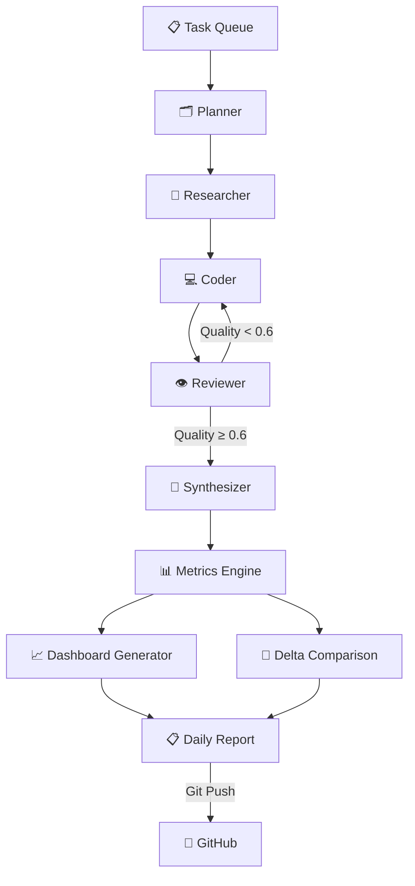
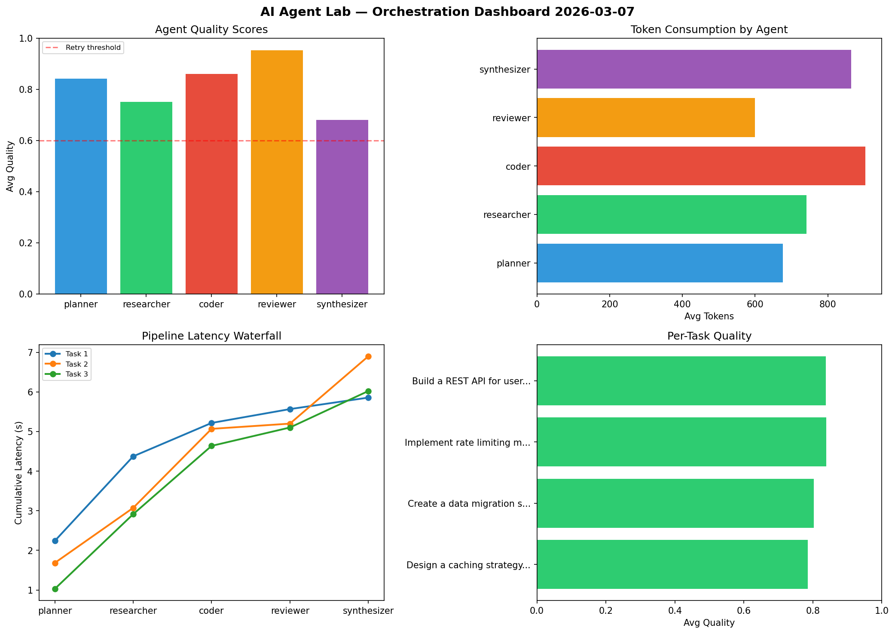

<div align="center">

# 🧪 AI Agent Lab

[](https://github.com/USER/ai-agent-lab/actions/workflows/daily_run.yml)


**Multi-agent LLM orchestration simulator with pipeline visualization and performance tracking.**

</div>

---

## Architecture



## Agent Pipeline

| Agent | Role | Temperature |
|-------|------|-------------|
| **Planner** | Decomposes tasks into subtasks | 0.3 |
| **Researcher** | Gathers information from knowledge base | 0.5 |
| **Coder** | Generates code solutions | 0.2 |
| **Reviewer** | Reviews and critiques outputs | 0.4 |
| **Synthesizer** | Combines outputs into final answer | 0.3 |

## Live Dashboard Preview



## Output Structure

```
logs/
├── YYYY-MM-DD.json          # Full pipeline data
├── YYYY-MM-DD.md            # Markdown report with delta analysis
└── YYYY-MM-DD_dashboard.png # 4-panel visual dashboard
```

## Quick Start

```bash
pip install -r dev-requirements.txt
python main.py
```
