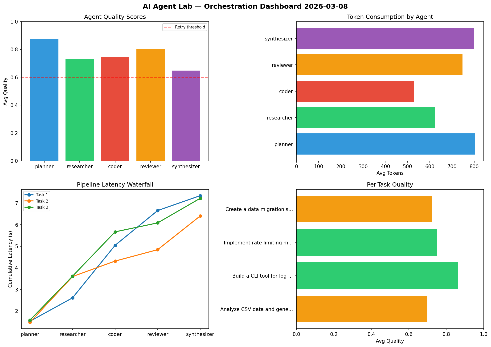

# AI Agent Lab — Orchestration Report 2026-03-08

**Run ID:** `ca94dc91be` | **Tasks:** 4 | **Avg Quality:** 0.76

## Aggregate Metrics

| Metric | Value |
|--------|-------|
| avg_latency | 6.651 |
| total_tokens | 13999 |
| avg_quality | 0.76 |

## Delta vs Yesterday

| Metric | Today | Yesterday | Change |
|--------|-------|-----------|--------|
| avg_latency | 6.651 | 6.577 | 📈 1.1% |
| total_tokens | 13999 | 15138 | 📉 -7.5% |
| avg_quality | 0.76 | 0.816 | 📉 -6.9% |

## Pipeline Results

### Analyze CSV data and generate statistical summary
| Agent | Quality | Latency | Tokens | Status |
|-------|---------|---------|--------|--------|
| planner | 0.683 | 1.526s | 648 | success |
| researcher | 0.907 | 1.084s | 689 | success |
| coder | 0.597 | 2.435s | 553 | needs_retry |
| reviewer | 0.765 | 1.61s | 770 | success |
| synthesizer | 0.546 | 0.69s | 761 | needs_retry |

### Build a CLI tool for log analysis
| Agent | Quality | Latency | Tokens | Status |
|-------|---------|---------|--------|--------|
| planner | 0.991 | 1.475s | 928 | success |
| researcher | 0.812 | 2.122s | 656 | success |
| coder | 0.916 | 0.717s | 500 | success |
| reviewer | 0.872 | 0.528s | 831 | success |
| synthesizer | 0.723 | 1.562s | 706 | success |

### Implement rate limiting middleware
| Agent | Quality | Latency | Tokens | Status |
|-------|---------|---------|--------|--------|
| planner | 0.97 | 1.58s | 662 | success |
| researcher | 0.509 | 2.034s | 253 | needs_retry |
| coder | 0.96 | 2.054s | 446 | success |
| reviewer | 0.626 | 0.415s | 633 | success |
| synthesizer | 0.697 | 1.14s | 519 | success |

### Create a data migration script for schema v2
| Agent | Quality | Latency | Tokens | Status |
|-------|---------|---------|--------|--------|
| planner | 0.85 | 0.581s | 971 | success |
| researcher | 0.691 | 0.769s | 893 | success |
| coder | 0.514 | 2.479s | 614 | needs_retry |
| reviewer | 0.942 | 0.932s | 753 | success |
| synthesizer | 0.626 | 0.873s | 1213 | success |
