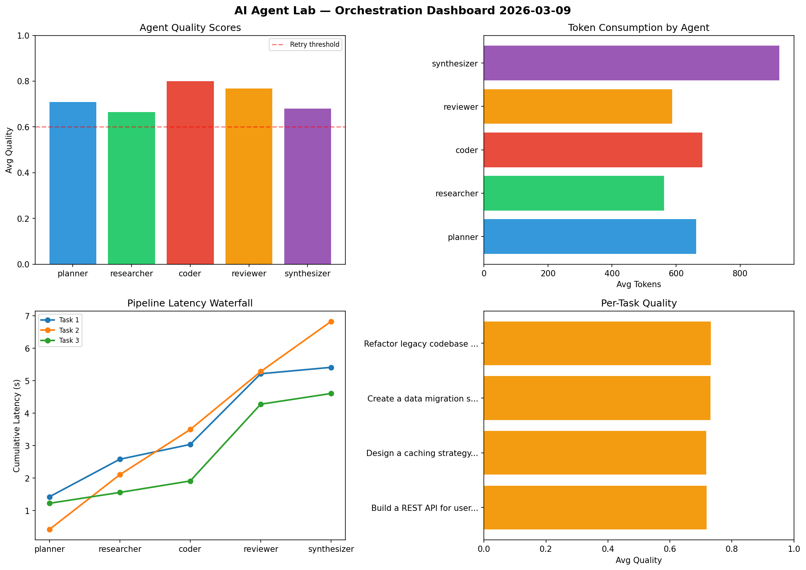

# AI Agent Lab — Orchestration Report 2026-03-09

**Run ID:** `8694edb326` | **Tasks:** 4 | **Avg Quality:** 0.724

## Aggregate Metrics

| Metric | Value |
|--------|-------|
| avg_latency | 6.511 |
| total_tokens | 13668 |
| avg_quality | 0.724 |

## Delta vs Yesterday

| Metric | Today | Yesterday | Change |
|--------|-------|-----------|--------|
| avg_latency | 6.511 | 6.651 | 📉 -2.1% |
| total_tokens | 13668 | 13999 | 📉 -2.4% |
| avg_quality | 0.724 | 0.76 | 📉 -4.7% |

## Pipeline Results

### Build a REST API for user authentication
| Agent | Quality | Latency | Tokens | Status |
|-------|---------|---------|--------|--------|
| planner | 0.835 | 1.426s | 684 | success |
| researcher | 0.539 | 1.157s | 846 | needs_retry |
| coder | 0.865 | 0.456s | 753 | success |
| reviewer | 0.739 | 2.176s | 625 | success |
| synthesizer | 0.61 | 0.197s | 1098 | success |

### Design a caching strategy for high-traffic endpoints
| Agent | Quality | Latency | Tokens | Status |
|-------|---------|---------|--------|--------|
| planner | 0.577 | 0.421s | 535 | needs_retry |
| researcher | 0.577 | 1.686s | 446 | needs_retry |
| coder | 0.916 | 1.391s | 497 | success |
| reviewer | 0.827 | 1.784s | 592 | success |
| synthesizer | 0.689 | 1.544s | 775 | success |

### Create a data migration script for schema v2
| Agent | Quality | Latency | Tokens | Status |
|-------|---------|---------|--------|--------|
| planner | 0.892 | 1.227s | 480 | success |
| researcher | 0.928 | 0.334s | 257 | success |
| coder | 0.563 | 0.354s | 744 | needs_retry |
| reviewer | 0.574 | 2.362s | 868 | needs_retry |
| synthesizer | 0.698 | 0.33s | 870 | success |

### Refactor legacy codebase to use dependency injection
| Agent | Quality | Latency | Tokens | Status |
|-------|---------|---------|--------|--------|
| planner | 0.534 | 2.395s | 952 | needs_retry |
| researcher | 0.613 | 1.898s | 702 | success |
| coder | 0.856 | 2.26s | 734 | success |
| reviewer | 0.933 | 1.221s | 265 | success |
| synthesizer | 0.723 | 1.424s | 945 | success |
