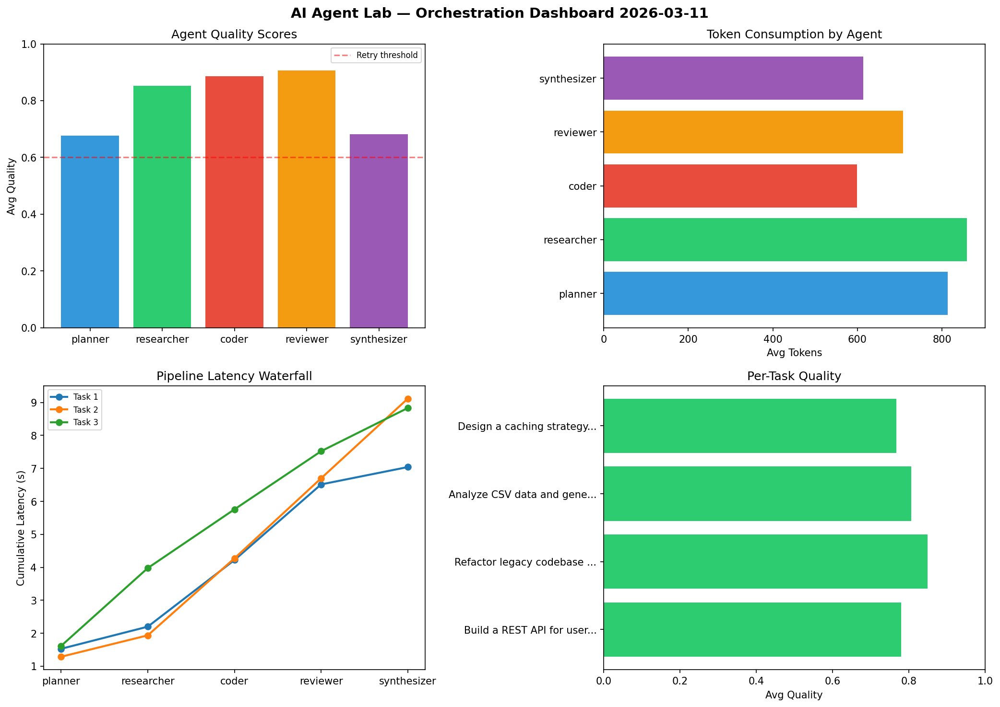

# AI Agent Lab — Orchestration Report 2026-03-11

**Run ID:** `a918eb370a` | **Tasks:** 4 | **Avg Quality:** 0.801

## Aggregate Metrics

| Metric | Value |
|--------|-------|
| avg_latency | 7.512 |
| total_tokens | 14372 |
| avg_quality | 0.801 |

## Delta vs Yesterday

| Metric | Today | Yesterday | Change |
|--------|-------|-----------|--------|
| avg_latency | 7.512 | 8.195 | 📉 -8.3% |
| total_tokens | 14372 | 13084 | 📈 9.8% |
| avg_quality | 0.801 | 0.73 | 📈 9.7% |

## Pipeline Results

### Build a REST API for user authentication
| Agent | Quality | Latency | Tokens | Status |
|-------|---------|---------|--------|--------|
| planner | 0.538 | 1.528s | 1192 | needs_retry |
| researcher | 0.733 | 0.671s | 881 | success |
| coder | 0.9 | 2.021s | 321 | success |
| reviewer | 0.935 | 2.295s | 972 | success |
| synthesizer | 0.793 | 0.526s | 475 | success |

### Refactor legacy codebase to use dependency injection
| Agent | Quality | Latency | Tokens | Status |
|-------|---------|---------|--------|--------|
| planner | 0.724 | 1.287s | 642 | success |
| researcher | 0.887 | 0.649s | 1005 | success |
| coder | 0.949 | 2.336s | 733 | success |
| reviewer | 0.867 | 2.428s | 778 | success |
| synthesizer | 0.819 | 2.417s | 810 | success |

### Analyze CSV data and generate statistical summary
| Agent | Quality | Latency | Tokens | Status |
|-------|---------|---------|--------|--------|
| planner | 0.884 | 1.615s | 456 | success |
| researcher | 0.86 | 2.362s | 1104 | success |
| coder | 0.837 | 1.781s | 458 | success |
| reviewer | 0.88 | 1.764s | 756 | success |
| synthesizer | 0.567 | 1.311s | 687 | needs_retry |

### Design a caching strategy for high-traffic endpoints
| Agent | Quality | Latency | Tokens | Status |
|-------|---------|---------|--------|--------|
| planner | 0.559 | 2.08s | 962 | needs_retry |
| researcher | 0.93 | 1.961s | 445 | success |
| coder | 0.859 | 0.421s | 884 | success |
| reviewer | 0.941 | 0.153s | 327 | success |
| synthesizer | 0.551 | 0.443s | 484 | needs_retry |
