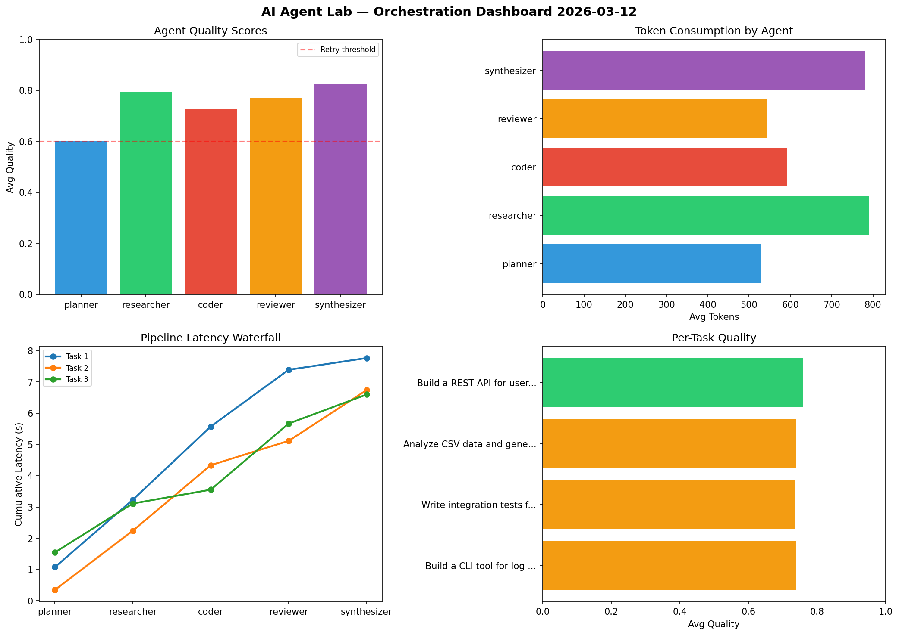

# AI Agent Lab — Orchestration Report 2026-03-12

**Run ID:** `e6b2fc5470` | **Tasks:** 4 | **Avg Quality:** 0.744

## Aggregate Metrics

| Metric | Value |
|--------|-------|
| avg_latency | 6.309 |
| total_tokens | 12948 |
| avg_quality | 0.744 |

## Delta vs Yesterday

| Metric | Today | Yesterday | Change |
|--------|-------|-----------|--------|
| avg_latency | 6.309 | 7.512 | 📉 -16.0% |
| total_tokens | 12948 | 14372 | 📉 -9.9% |
| avg_quality | 0.744 | 0.801 | 📉 -7.1% |

## Pipeline Results

### Build a CLI tool for log analysis
| Agent | Quality | Latency | Tokens | Status |
|-------|---------|---------|--------|--------|
| planner | 0.601 | 1.073s | 773 | success |
| researcher | 0.866 | 2.158s | 943 | success |
| coder | 0.789 | 2.343s | 677 | success |
| reviewer | 0.843 | 1.816s | 701 | success |
| synthesizer | 0.598 | 0.375s | 547 | needs_retry |

### Write integration tests for payment processing module
| Agent | Quality | Latency | Tokens | Status |
|-------|---------|---------|--------|--------|
| planner | 0.556 | 0.347s | 184 | needs_retry |
| researcher | 0.805 | 1.893s | 607 | success |
| coder | 0.596 | 2.097s | 685 | needs_retry |
| reviewer | 0.807 | 0.778s | 524 | success |
| synthesizer | 0.919 | 1.623s | 643 | success |

### Analyze CSV data and generate statistical summary
| Agent | Quality | Latency | Tokens | Status |
|-------|---------|---------|--------|--------|
| planner | 0.676 | 1.547s | 429 | success |
| researcher | 0.95 | 1.563s | 774 | success |
| coder | 0.598 | 0.443s | 261 | needs_retry |
| reviewer | 0.566 | 2.115s | 732 | needs_retry |
| synthesizer | 0.899 | 0.929s | 1111 | success |

### Build a REST API for user authentication
| Agent | Quality | Latency | Tokens | Status |
|-------|---------|---------|--------|--------|
| planner | 0.573 | 1.634s | 732 | needs_retry |
| researcher | 0.55 | 0.519s | 840 | needs_retry |
| coder | 0.92 | 0.133s | 741 | success |
| reviewer | 0.868 | 0.911s | 218 | success |
| synthesizer | 0.89 | 0.939s | 826 | success |
