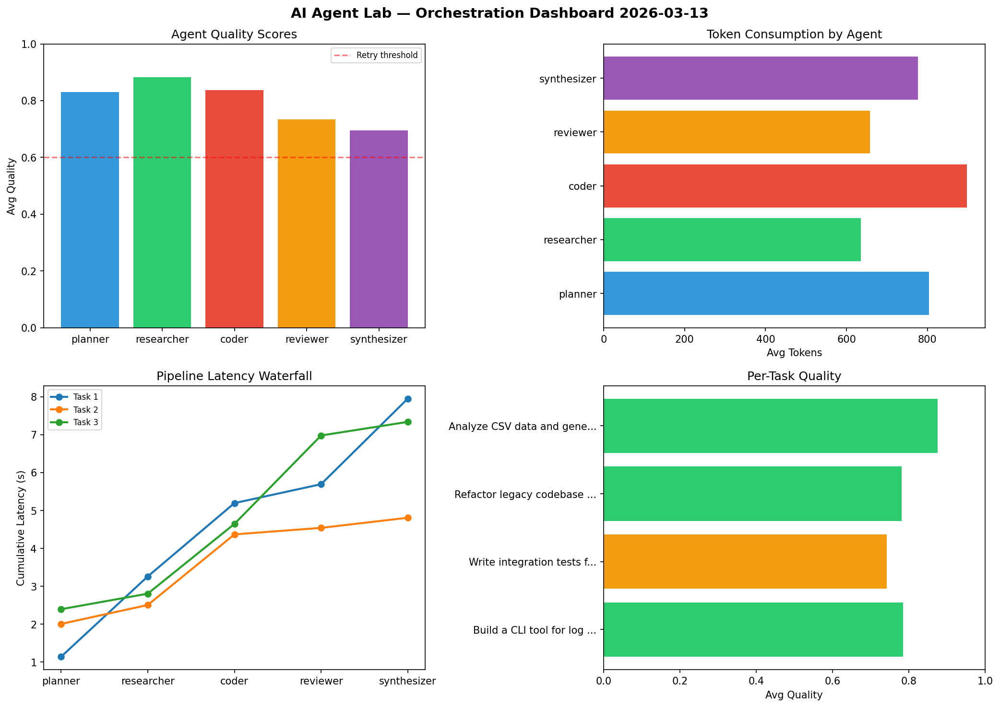

# AI Agent Lab — Orchestration Report 2026-03-13

**Run ID:** `e8813f25b9` | **Tasks:** 4 | **Avg Quality:** 0.796

## Aggregate Metrics

| Metric | Value |
|--------|-------|
| avg_latency | 5.833 |
| total_tokens | 15085 |
| avg_quality | 0.796 |

## Delta vs Yesterday

| Metric | Today | Yesterday | Change |
|--------|-------|-----------|--------|
| avg_latency | 5.833 | 6.507 | 📉 -10.4% |
| total_tokens | 15085 | 15113 | 📉 -0.2% |
| avg_quality | 0.796 | 0.8 | 📉 -0.5% |

## Pipeline Results

### Build a CLI tool for log analysis
| Agent | Quality | Latency | Tokens | Status |
|-------|---------|---------|--------|--------|
| planner | 0.68 | 1.142s | 930 | success |
| researcher | 0.994 | 2.119s | 756 | success |
| coder | 0.859 | 1.934s | 811 | success |
| reviewer | 0.701 | 0.499s | 686 | success |
| synthesizer | 0.689 | 2.257s | 915 | success |

### Write integration tests for payment processing module
| Agent | Quality | Latency | Tokens | Status |
|-------|---------|---------|--------|--------|
| planner | 0.949 | 2.008s | 785 | success |
| researcher | 0.682 | 0.499s | 845 | success |
| coder | 0.936 | 1.863s | 743 | success |
| reviewer | 0.572 | 0.172s | 520 | needs_retry |
| synthesizer | 0.572 | 0.267s | 681 | needs_retry |

### Refactor legacy codebase to use dependency injection
| Agent | Quality | Latency | Tokens | Status |
|-------|---------|---------|--------|--------|
| planner | 0.881 | 2.396s | 385 | success |
| researcher | 0.921 | 0.41s | 433 | success |
| coder | 0.576 | 1.84s | 1086 | needs_retry |
| reviewer | 0.753 | 2.333s | 690 | success |
| synthesizer | 0.778 | 0.359s | 724 | success |

### Analyze CSV data and generate statistical summary
| Agent | Quality | Latency | Tokens | Status |
|-------|---------|---------|--------|--------|
| planner | 0.814 | 1.034s | 1116 | success |
| researcher | 0.936 | 0.767s | 506 | success |
| coder | 0.98 | 0.26s | 949 | success |
| reviewer | 0.91 | 0.995s | 736 | success |
| synthesizer | 0.741 | 0.178s | 788 | success |
