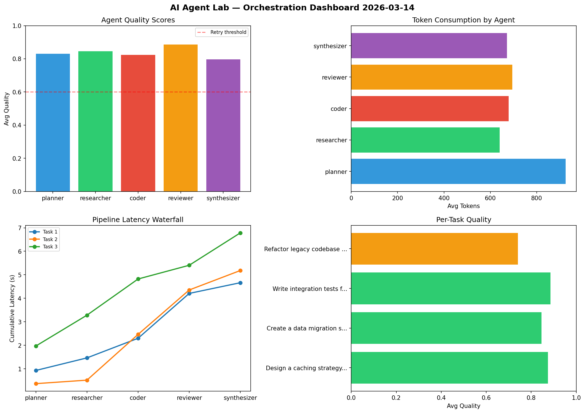

# AI Agent Lab — Orchestration Report 2026-03-14

**Run ID:** `40ff25bc71` | **Tasks:** 4 | **Avg Quality:** 0.836

## Aggregate Metrics

| Metric | Value |
|--------|-------|
| avg_latency | 5.62 |
| total_tokens | 14440 |
| avg_quality | 0.836 |

## Delta vs Yesterday

| Metric | Today | Yesterday | Change |
|--------|-------|-----------|--------|
| avg_latency | 5.62 | 5.833 | 📉 -3.7% |
| total_tokens | 14440 | 15085 | 📉 -4.3% |
| avg_quality | 0.836 | 0.796 | 📈 5.0% |

## Pipeline Results

### Design a caching strategy for high-traffic endpoints
| Agent | Quality | Latency | Tokens | Status |
|-------|---------|---------|--------|--------|
| planner | 0.667 | 0.928s | 892 | success |
| researcher | 0.957 | 0.535s | 639 | success |
| coder | 0.899 | 0.835s | 500 | success |
| reviewer | 0.967 | 1.909s | 589 | success |
| synthesizer | 0.879 | 0.456s | 413 | success |

### Create a data migration script for schema v2
| Agent | Quality | Latency | Tokens | Status |
|-------|---------|---------|--------|--------|
| planner | 0.708 | 0.367s | 1174 | success |
| researcher | 0.663 | 0.149s | 848 | success |
| coder | 0.978 | 1.947s | 690 | success |
| reviewer | 0.986 | 1.89s | 678 | success |
| synthesizer | 0.888 | 0.829s | 997 | success |

### Write integration tests for payment processing module
| Agent | Quality | Latency | Tokens | Status |
|-------|---------|---------|--------|--------|
| planner | 0.945 | 1.967s | 790 | success |
| researcher | 0.942 | 1.314s | 859 | success |
| coder | 0.884 | 1.54s | 661 | success |
| reviewer | 0.772 | 0.584s | 889 | success |
| synthesizer | 0.884 | 1.379s | 519 | success |

### Refactor legacy codebase to use dependency injection
| Agent | Quality | Latency | Tokens | Status |
|-------|---------|---------|--------|--------|
| planner | 0.998 | 0.997s | 842 | success |
| researcher | 0.822 | 1.272s | 214 | success |
| coder | 0.532 | 2.117s | 866 | needs_retry |
| reviewer | 0.822 | 0.26s | 623 | success |
| synthesizer | 0.532 | 1.203s | 757 | needs_retry |
