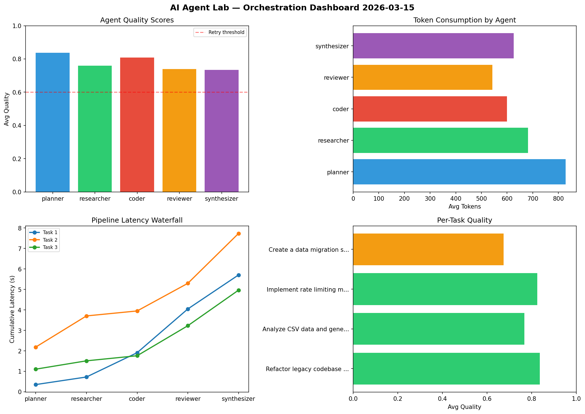

# AI Agent Lab — Orchestration Report 2026-03-15

**Run ID:** `7904af41c5` | **Tasks:** 4 | **Avg Quality:** 0.776

## Aggregate Metrics

| Metric | Value |
|--------|-------|
| avg_latency | 6.441 |
| total_tokens | 13109 |
| avg_quality | 0.776 |

## Delta vs Yesterday

| Metric | Today | Yesterday | Change |
|--------|-------|-----------|--------|
| avg_latency | 6.441 | 5.62 | 📈 14.6% |
| total_tokens | 13109 | 14440 | 📉 -9.2% |
| avg_quality | 0.776 | 0.836 | 📉 -7.2% |

## Pipeline Results

### Refactor legacy codebase to use dependency injection
| Agent | Quality | Latency | Tokens | Status |
|-------|---------|---------|--------|--------|
| planner | 0.738 | 0.353s | 948 | success |
| researcher | 0.746 | 0.37s | 619 | success |
| coder | 0.923 | 1.187s | 642 | success |
| reviewer | 0.995 | 2.138s | 723 | success |
| synthesizer | 0.783 | 1.661s | 506 | success |

### Analyze CSV data and generate statistical summary
| Agent | Quality | Latency | Tokens | Status |
|-------|---------|---------|--------|--------|
| planner | 0.767 | 2.185s | 858 | success |
| researcher | 0.95 | 1.522s | 681 | success |
| coder | 0.758 | 0.243s | 624 | success |
| reviewer | 0.562 | 1.35s | 837 | needs_retry |
| synthesizer | 0.796 | 2.437s | 605 | success |

### Implement rate limiting middleware
| Agent | Quality | Latency | Tokens | Status |
|-------|---------|---------|--------|--------|
| planner | 0.997 | 1.106s | 969 | success |
| researcher | 0.833 | 0.407s | 667 | success |
| coder | 0.686 | 0.249s | 617 | success |
| reviewer | 0.848 | 1.467s | 156 | success |
| synthesizer | 0.761 | 1.737s | 669 | success |

### Create a data migration script for schema v2
| Agent | Quality | Latency | Tokens | Status |
|-------|---------|---------|--------|--------|
| planner | 0.849 | 0.656s | 537 | success |
| researcher | 0.511 | 2.26s | 758 | needs_retry |
| coder | 0.865 | 0.808s | 514 | success |
| reviewer | 0.55 | 2.387s | 454 | needs_retry |
| synthesizer | 0.597 | 1.242s | 725 | needs_retry |
