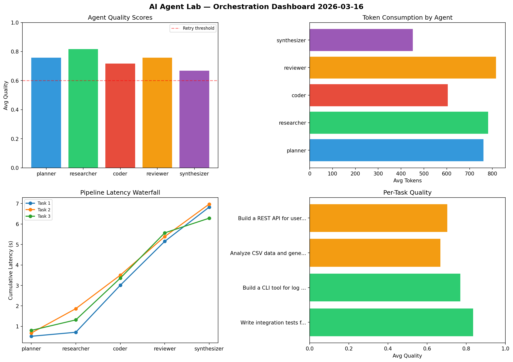

# AI Agent Lab — Orchestration Report 2026-03-16

**Run ID:** `970f2d6887` | **Tasks:** 4 | **Avg Quality:** 0.744

## Aggregate Metrics

| Metric | Value |
|--------|-------|
| avg_latency | 6.366 |
| total_tokens | 13659 |
| avg_quality | 0.744 |

## Delta vs Yesterday

| Metric | Today | Yesterday | Change |
|--------|-------|-----------|--------|
| avg_latency | 6.366 | 6.441 | 📉 -1.2% |
| total_tokens | 13659 | 13109 | 📈 4.2% |
| avg_quality | 0.744 | 0.776 | 📉 -4.1% |

## Pipeline Results

### Write integration tests for payment processing module
| Agent | Quality | Latency | Tokens | Status |
|-------|---------|---------|--------|--------|
| planner | 0.961 | 0.518s | 341 | success |
| researcher | 0.724 | 0.196s | 760 | success |
| coder | 0.834 | 2.294s | 588 | success |
| reviewer | 0.859 | 2.143s | 976 | success |
| synthesizer | 0.798 | 1.673s | 399 | success |

### Build a CLI tool for log analysis
| Agent | Quality | Latency | Tokens | Status |
|-------|---------|---------|--------|--------|
| planner | 0.586 | 0.677s | 1215 | needs_retry |
| researcher | 0.84 | 1.19s | 694 | success |
| coder | 0.613 | 1.633s | 390 | success |
| reviewer | 0.997 | 1.886s | 514 | success |
| synthesizer | 0.816 | 1.584s | 432 | success |

### Analyze CSV data and generate statistical summary
| Agent | Quality | Latency | Tokens | Status |
|-------|---------|---------|--------|--------|
| planner | 0.536 | 0.805s | 402 | needs_retry |
| researcher | 0.802 | 0.513s | 965 | success |
| coder | 0.841 | 2.036s | 1007 | success |
| reviewer | 0.62 | 2.212s | 578 | success |
| synthesizer | 0.54 | 0.717s | 412 | needs_retry |

### Build a REST API for user authentication
| Agent | Quality | Latency | Tokens | Status |
|-------|---------|---------|--------|--------|
| planner | 0.95 | 1.119s | 1087 | success |
| researcher | 0.904 | 0.694s | 707 | success |
| coder | 0.581 | 1.614s | 433 | needs_retry |
| reviewer | 0.558 | 1.198s | 1195 | needs_retry |
| synthesizer | 0.521 | 0.76s | 564 | needs_retry |
