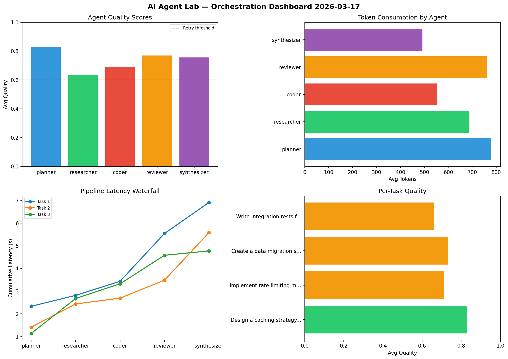

# AI Agent Lab — Orchestration Report 2026-03-17

**Run ID:** `e49d4c09a2` | **Tasks:** 4 | **Avg Quality:** 0.735

## Aggregate Metrics

| Metric | Value |
|--------|-------|
| avg_latency | 5.556 |
| total_tokens | 13085 |
| avg_quality | 0.735 |

## Delta vs Yesterday

| Metric | Today | Yesterday | Change |
|--------|-------|-----------|--------|
| avg_latency | 5.556 | 7.777 | 📉 -28.6% |
| total_tokens | 13085 | 15558 | 📉 -15.9% |
| avg_quality | 0.735 | 0.79 | 📉 -7.0% |

## Pipeline Results

### Design a caching strategy for high-traffic endpoints
| Agent | Quality | Latency | Tokens | Status |
|-------|---------|---------|--------|--------|
| planner | 0.803 | 2.33s | 600 | success |
| researcher | 0.67 | 0.482s | 868 | success |
| coder | 0.741 | 0.623s | 469 | success |
| reviewer | 0.95 | 2.11s | 875 | success |
| synthesizer | 0.992 | 1.368s | 379 | success |

### Implement rate limiting middleware
| Agent | Quality | Latency | Tokens | Status |
|-------|---------|---------|--------|--------|
| planner | 0.677 | 1.405s | 1003 | success |
| researcher | 0.788 | 1.028s | 530 | success |
| coder | 0.631 | 0.257s | 432 | success |
| reviewer | 0.631 | 0.795s | 580 | success |
| synthesizer | 0.844 | 2.101s | 550 | success |

### Create a data migration script for schema v2
| Agent | Quality | Latency | Tokens | Status |
|-------|---------|---------|--------|--------|
| planner | 0.873 | 1.131s | 852 | success |
| researcher | 0.531 | 1.542s | 939 | needs_retry |
| coder | 0.744 | 0.651s | 688 | success |
| reviewer | 0.872 | 1.257s | 1019 | success |
| synthesizer | 0.65 | 0.193s | 398 | success |

### Write integration tests for payment processing module
| Agent | Quality | Latency | Tokens | Status |
|-------|---------|---------|--------|--------|
| planner | 0.963 | 0.939s | 659 | success |
| researcher | 0.54 | 0.833s | 406 | needs_retry |
| coder | 0.644 | 0.647s | 624 | success |
| reviewer | 0.625 | 2.29s | 574 | success |
| synthesizer | 0.537 | 0.243s | 640 | needs_retry |
