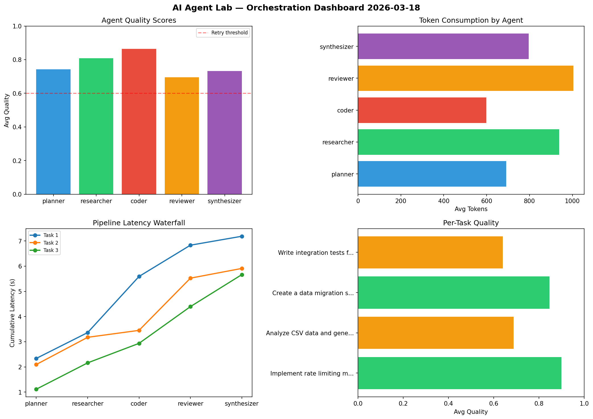

# AI Agent Lab — Orchestration Report 2026-03-18

**Run ID:** `c85fedc3ca` | **Tasks:** 4 | **Avg Quality:** 0.769

## Aggregate Metrics

| Metric | Value |
|--------|-------|
| avg_latency | 6.602 |
| total_tokens | 16121 |
| avg_quality | 0.769 |

## Delta vs Yesterday

| Metric | Today | Yesterday | Change |
|--------|-------|-----------|--------|
| avg_latency | 6.602 | 6.124 | 📈 7.8% |
| total_tokens | 16121 | 15892 | 📈 1.4% |
| avg_quality | 0.769 | 0.77 | 📉 -0.1% |

## Pipeline Results

### Implement rate limiting middleware
| Agent | Quality | Latency | Tokens | Status |
|-------|---------|---------|--------|--------|
| planner | 0.913 | 2.335s | 594 | success |
| researcher | 0.856 | 1.026s | 633 | success |
| coder | 0.988 | 2.229s | 932 | success |
| reviewer | 0.752 | 1.242s | 1163 | success |
| synthesizer | 0.989 | 0.355s | 346 | success |

### Analyze CSV data and generate statistical summary
| Agent | Quality | Latency | Tokens | Status |
|-------|---------|---------|--------|--------|
| planner | 0.593 | 2.093s | 371 | needs_retry |
| researcher | 0.723 | 1.081s | 1221 | success |
| coder | 0.859 | 0.276s | 344 | success |
| reviewer | 0.764 | 2.073s | 630 | success |
| synthesizer | 0.502 | 0.386s | 917 | needs_retry |

### Create a data migration script for schema v2
| Agent | Quality | Latency | Tokens | Status |
|-------|---------|---------|--------|--------|
| planner | 0.931 | 1.113s | 1039 | success |
| researcher | 0.983 | 1.046s | 1155 | success |
| coder | 0.931 | 0.775s | 805 | success |
| reviewer | 0.583 | 1.459s | 1029 | needs_retry |
| synthesizer | 0.806 | 1.27s | 993 | success |

### Write integration tests for payment processing module
| Agent | Quality | Latency | Tokens | Status |
|-------|---------|---------|--------|--------|
| planner | 0.531 | 2.146s | 764 | needs_retry |
| researcher | 0.674 | 0.512s | 744 | success |
| coder | 0.68 | 2.084s | 314 | success |
| reviewer | 0.683 | 0.711s | 1196 | success |
| synthesizer | 0.635 | 2.197s | 931 | success |
