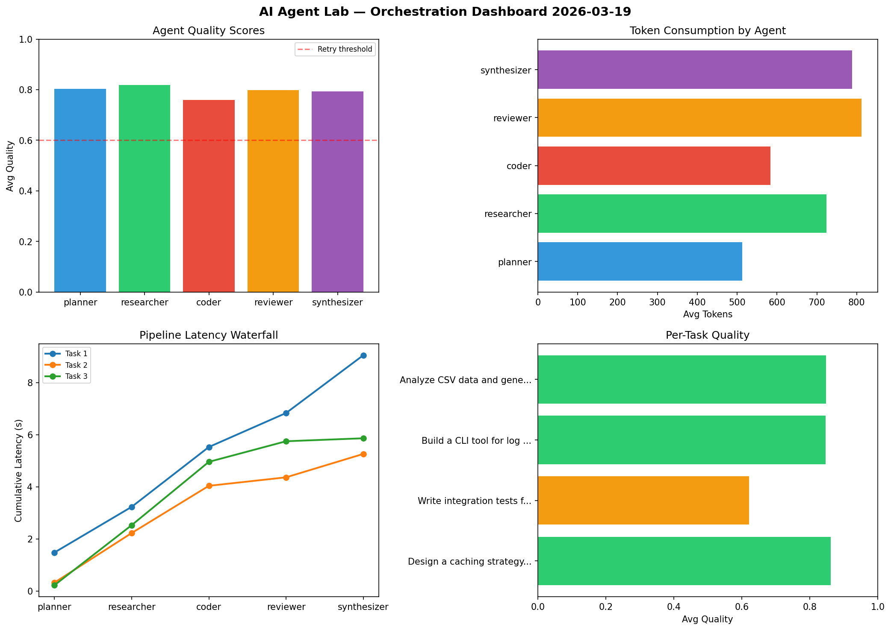

# AI Agent Lab — Orchestration Report 2026-03-19

**Run ID:** `60e4650c5f` | **Tasks:** 4 | **Avg Quality:** 0.794

## Aggregate Metrics

| Metric | Value |
|--------|-------|
| avg_latency | 7.206 |
| total_tokens | 13688 |
| avg_quality | 0.794 |

## Delta vs Yesterday

| Metric | Today | Yesterday | Change |
|--------|-------|-----------|--------|
| avg_latency | 7.206 | 8.255 | 📉 -12.7% |
| total_tokens | 13688 | 13897 | 📉 -1.5% |
| avg_quality | 0.794 | 0.728 | 📈 9.1% |

## Pipeline Results

### Design a caching strategy for high-traffic endpoints
| Agent | Quality | Latency | Tokens | Status |
|-------|---------|---------|--------|--------|
| planner | 0.929 | 1.48s | 785 | success |
| researcher | 0.848 | 1.752s | 708 | success |
| coder | 0.593 | 2.298s | 486 | needs_retry |
| reviewer | 0.941 | 1.305s | 668 | success |
| synthesizer | 0.999 | 2.218s | 1055 | success |

### Write integration tests for payment processing module
| Agent | Quality | Latency | Tokens | Status |
|-------|---------|---------|--------|--------|
| planner | 0.72 | 0.324s | 571 | success |
| researcher | 0.572 | 1.903s | 965 | needs_retry |
| coder | 0.656 | 1.813s | 796 | success |
| reviewer | 0.616 | 0.326s | 939 | success |
| synthesizer | 0.541 | 0.898s | 739 | needs_retry |

### Build a CLI tool for log analysis
| Agent | Quality | Latency | Tokens | Status |
|-------|---------|---------|--------|--------|
| planner | 0.934 | 0.224s | 443 | success |
| researcher | 0.891 | 2.305s | 550 | success |
| coder | 0.83 | 2.431s | 441 | success |
| reviewer | 0.686 | 0.791s | 855 | success |
| synthesizer | 0.896 | 0.114s | 720 | success |

### Analyze CSV data and generate statistical summary
| Agent | Quality | Latency | Tokens | Status |
|-------|---------|---------|--------|--------|
| planner | 0.631 | 1.791s | 254 | success |
| researcher | 0.96 | 2.457s | 673 | success |
| coder | 0.96 | 1.253s | 612 | success |
| reviewer | 0.952 | 1.837s | 786 | success |
| synthesizer | 0.738 | 1.305s | 642 | success |
