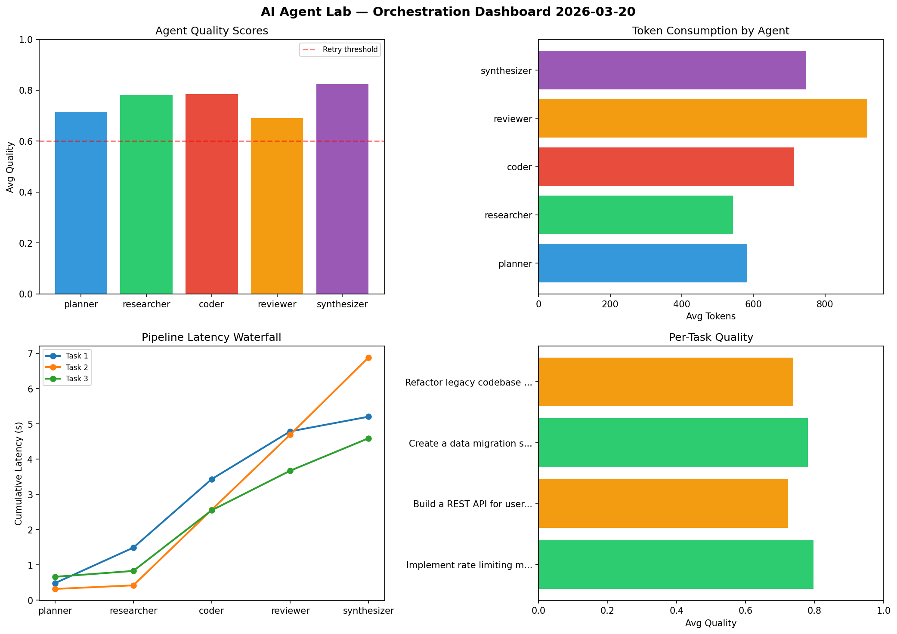

# AI Agent Lab — Orchestration Report 2026-03-20

**Run ID:** `358432cf7f` | **Tasks:** 4 | **Avg Quality:** 0.76

## Aggregate Metrics

| Metric | Value |
|--------|-------|
| avg_latency | 6.106 |
| total_tokens | 14017 |
| avg_quality | 0.76 |

## Delta vs Yesterday

| Metric | Today | Yesterday | Change |
|--------|-------|-----------|--------|
| avg_latency | 6.106 | 5.981 | 📈 2.1% |
| total_tokens | 14017 | 14988 | 📉 -6.5% |
| avg_quality | 0.76 | 0.762 | 📉 -0.3% |

## Pipeline Results

### Implement rate limiting middleware
| Agent | Quality | Latency | Tokens | Status |
|-------|---------|---------|--------|--------|
| planner | 0.65 | 0.479s | 791 | success |
| researcher | 0.849 | 1.008s | 655 | success |
| coder | 0.725 | 1.945s | 897 | success |
| reviewer | 0.776 | 1.353s | 910 | success |
| synthesizer | 0.983 | 0.417s | 507 | success |

### Build a REST API for user authentication
| Agent | Quality | Latency | Tokens | Status |
|-------|---------|---------|--------|--------|
| planner | 0.831 | 0.316s | 849 | success |
| researcher | 0.633 | 0.102s | 733 | success |
| coder | 0.531 | 2.144s | 502 | needs_retry |
| reviewer | 0.663 | 2.129s | 964 | success |
| synthesizer | 0.957 | 2.191s | 1123 | success |

### Create a data migration script for schema v2
| Agent | Quality | Latency | Tokens | Status |
|-------|---------|---------|--------|--------|
| planner | 0.508 | 0.66s | 414 | needs_retry |
| researcher | 0.991 | 0.167s | 268 | success |
| coder | 0.982 | 1.721s | 564 | success |
| reviewer | 0.712 | 1.121s | 778 | success |
| synthesizer | 0.711 | 0.921s | 678 | success |

### Refactor legacy codebase to use dependency injection
| Agent | Quality | Latency | Tokens | Status |
|-------|---------|---------|--------|--------|
| planner | 0.875 | 0.62s | 277 | success |
| researcher | 0.653 | 2.231s | 515 | success |
| coder | 0.902 | 2.118s | 892 | success |
| reviewer | 0.613 | 1.356s | 1019 | success |
| synthesizer | 0.645 | 1.424s | 681 | success |
