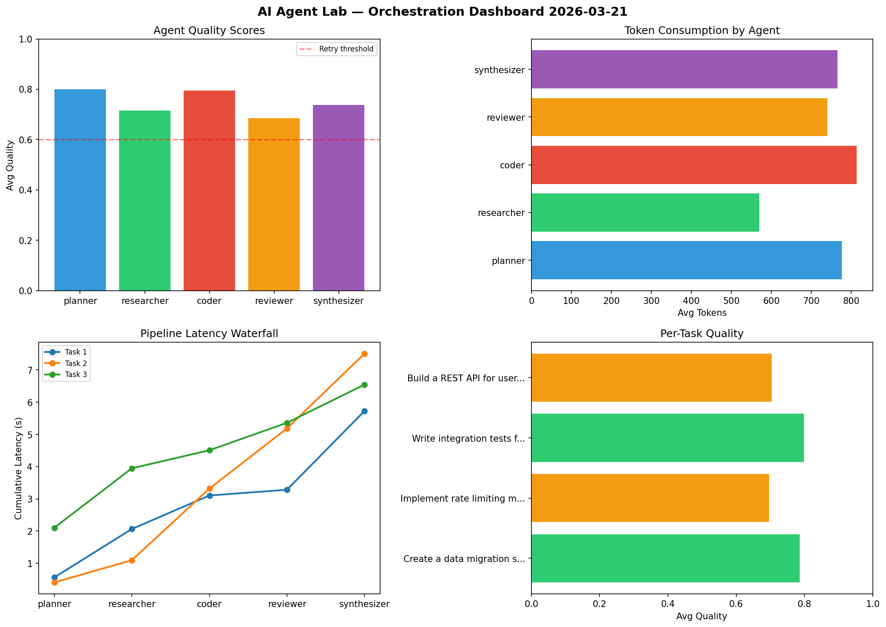

# AI Agent Lab — Orchestration Report 2026-03-21

**Run ID:** `80895187c5` | **Tasks:** 4 | **Avg Quality:** 0.746

## Aggregate Metrics

| Metric | Value |
|--------|-------|
| avg_latency | 7.263 |
| total_tokens | 14664 |
| avg_quality | 0.746 |

## Delta vs Yesterday

| Metric | Today | Yesterday | Change |
|--------|-------|-----------|--------|
| avg_latency | 7.263 | 7.25 | 📈 0.2% |
| total_tokens | 14664 | 13880 | 📈 5.6% |
| avg_quality | 0.746 | 0.738 | 📈 1.1% |

## Pipeline Results

### Create a data migration script for schema v2
| Agent | Quality | Latency | Tokens | Status |
|-------|---------|---------|--------|--------|
| planner | 0.824 | 0.561s | 866 | success |
| researcher | 0.532 | 1.503s | 618 | needs_retry |
| coder | 0.992 | 1.04s | 1052 | success |
| reviewer | 0.648 | 0.179s | 767 | success |
| synthesizer | 0.934 | 2.447s | 968 | success |

### Implement rate limiting middleware
| Agent | Quality | Latency | Tokens | Status |
|-------|---------|---------|--------|--------|
| planner | 0.849 | 0.405s | 934 | success |
| researcher | 0.745 | 0.691s | 398 | success |
| coder | 0.717 | 2.223s | 552 | success |
| reviewer | 0.654 | 1.869s | 766 | success |
| synthesizer | 0.519 | 2.324s | 539 | needs_retry |

### Write integration tests for payment processing module
| Agent | Quality | Latency | Tokens | Status |
|-------|---------|---------|--------|--------|
| planner | 0.877 | 2.102s | 787 | success |
| researcher | 0.964 | 1.847s | 409 | success |
| coder | 0.597 | 0.56s | 1126 | needs_retry |
| reviewer | 0.938 | 0.853s | 769 | success |
| synthesizer | 0.619 | 1.186s | 547 | success |

### Build a REST API for user authentication
| Agent | Quality | Latency | Tokens | Status |
|-------|---------|---------|--------|--------|
| planner | 0.649 | 1.69s | 520 | success |
| researcher | 0.618 | 2.143s | 855 | success |
| coder | 0.875 | 1.865s | 523 | success |
| reviewer | 0.502 | 1.77s | 658 | needs_retry |
| synthesizer | 0.875 | 1.795s | 1010 | success |
