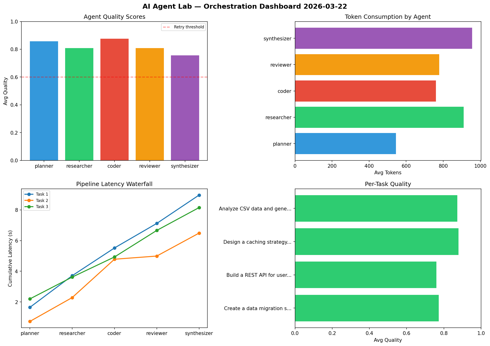

# AI Agent Lab — Orchestration Report 2026-03-22

**Run ID:** `2db4c707b8` | **Tasks:** 4 | **Avg Quality:** 0.821

## Aggregate Metrics

| Metric | Value |
|--------|-------|
| avg_latency | 6.941 |
| total_tokens | 15798 |
| avg_quality | 0.821 |

## Delta vs Yesterday

| Metric | Today | Yesterday | Change |
|--------|-------|-----------|--------|
| avg_latency | 6.941 | 6.172 | 📈 12.5% |
| total_tokens | 15798 | 13842 | 📈 14.1% |
| avg_quality | 0.821 | 0.751 | 📈 9.3% |

## Pipeline Results

### Create a data migration script for schema v2
| Agent | Quality | Latency | Tokens | Status |
|-------|---------|---------|--------|--------|
| planner | 0.792 | 1.65s | 567 | success |
| researcher | 0.961 | 2.061s | 706 | success |
| coder | 0.572 | 1.809s | 947 | needs_retry |
| reviewer | 0.908 | 1.599s | 1052 | success |
| synthesizer | 0.634 | 1.846s | 1094 | success |

### Build a REST API for user authentication
| Agent | Quality | Latency | Tokens | Status |
|-------|---------|---------|--------|--------|
| planner | 0.845 | 0.733s | 650 | success |
| researcher | 0.538 | 1.553s | 1118 | needs_retry |
| coder | 0.983 | 2.499s | 842 | success |
| reviewer | 0.752 | 0.207s | 837 | success |
| synthesizer | 0.684 | 1.495s | 987 | success |

### Design a caching strategy for high-traffic endpoints
| Agent | Quality | Latency | Tokens | Status |
|-------|---------|---------|--------|--------|
| planner | 0.823 | 2.2s | 565 | success |
| researcher | 0.925 | 1.422s | 936 | success |
| coder | 1.0 | 1.31s | 890 | success |
| reviewer | 0.667 | 1.73s | 454 | success |
| synthesizer | 0.981 | 1.488s | 965 | success |

### Analyze CSV data and generate statistical summary
| Agent | Quality | Latency | Tokens | Status |
|-------|---------|---------|--------|--------|
| planner | 0.97 | 0.409s | 395 | success |
| researcher | 0.811 | 2.321s | 881 | success |
| coder | 0.95 | 0.69s | 365 | success |
| reviewer | 0.907 | 0.31s | 768 | success |
| synthesizer | 0.724 | 0.433s | 779 | success |
