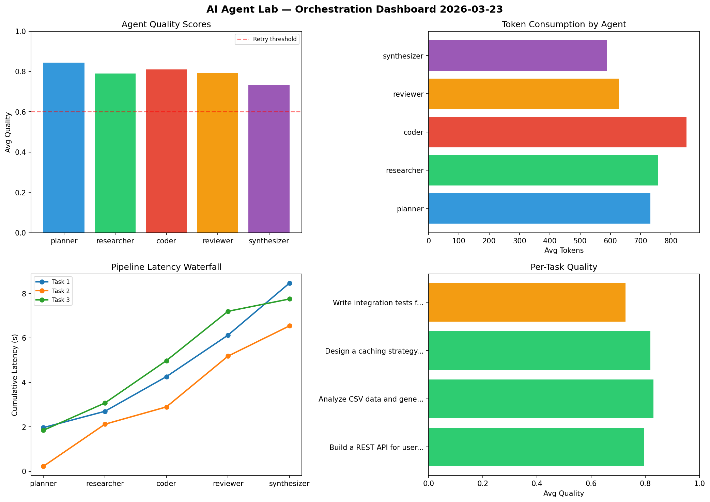

# AI Agent Lab — Orchestration Report 2026-03-23

**Run ID:** `da1dc9a4e7` | **Tasks:** 4 | **Avg Quality:** 0.793

## Aggregate Metrics

| Metric | Value |
|--------|-------|
| avg_latency | 7.954 |
| total_tokens | 14229 |
| avg_quality | 0.793 |

## Delta vs Yesterday

| Metric | Today | Yesterday | Change |
|--------|-------|-----------|--------|
| avg_latency | 7.954 | 6.941 | 📈 14.6% |
| total_tokens | 14229 | 15798 | 📉 -9.9% |
| avg_quality | 0.793 | 0.821 | 📉 -3.4% |

## Pipeline Results

### Build a REST API for user authentication
| Agent | Quality | Latency | Tokens | Status |
|-------|---------|---------|--------|--------|
| planner | 0.964 | 1.967s | 528 | success |
| researcher | 0.64 | 0.733s | 972 | success |
| coder | 0.829 | 1.561s | 1092 | success |
| reviewer | 0.729 | 1.865s | 605 | success |
| synthesizer | 0.824 | 2.343s | 455 | success |

### Analyze CSV data and generate statistical summary
| Agent | Quality | Latency | Tokens | Status |
|-------|---------|---------|--------|--------|
| planner | 0.772 | 0.226s | 626 | success |
| researcher | 0.988 | 1.894s | 509 | success |
| coder | 0.861 | 0.779s | 520 | success |
| reviewer | 0.937 | 2.283s | 853 | success |
| synthesizer | 0.599 | 1.362s | 526 | needs_retry |

### Design a caching strategy for high-traffic endpoints
| Agent | Quality | Latency | Tokens | Status |
|-------|---------|---------|--------|--------|
| planner | 0.738 | 1.846s | 1146 | success |
| researcher | 0.851 | 1.228s | 699 | success |
| coder | 0.839 | 1.907s | 674 | success |
| reviewer | 0.67 | 2.218s | 335 | success |
| synthesizer | 0.997 | 0.554s | 825 | success |

### Write integration tests for payment processing module
| Agent | Quality | Latency | Tokens | Status |
|-------|---------|---------|--------|--------|
| planner | 0.903 | 2.299s | 627 | success |
| researcher | 0.677 | 1.157s | 851 | success |
| coder | 0.713 | 2.306s | 1119 | success |
| reviewer | 0.828 | 0.9s | 718 | success |
| synthesizer | 0.512 | 2.386s | 549 | needs_retry |
