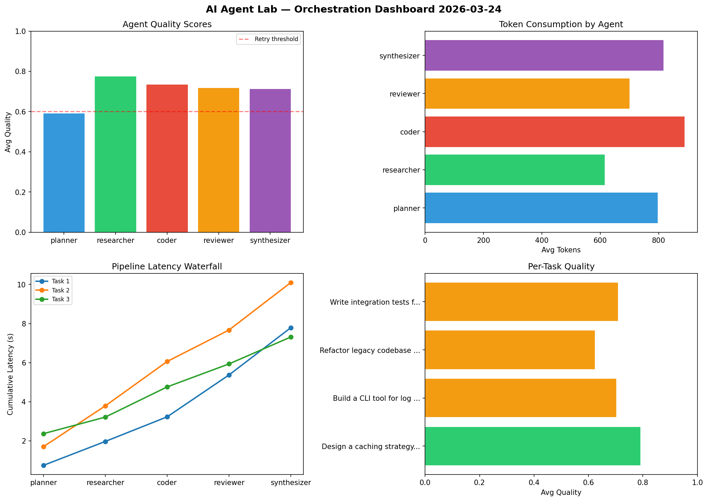

# AI Agent Lab — Orchestration Report 2026-03-24

**Run ID:** `618c94f6eb` | **Tasks:** 4 | **Avg Quality:** 0.706

## Aggregate Metrics

| Metric | Value |
|--------|-------|
| avg_latency | 8.478 |
| total_tokens | 15267 |
| avg_quality | 0.706 |

## Delta vs Yesterday

| Metric | Today | Yesterday | Change |
|--------|-------|-----------|--------|
| avg_latency | 8.478 | 6.701 | 📈 26.5% |
| total_tokens | 15267 | 14958 | 📈 2.1% |
| avg_quality | 0.706 | 0.678 | 📈 4.1% |

## Pipeline Results

### Design a caching strategy for high-traffic endpoints
| Agent | Quality | Latency | Tokens | Status |
|-------|---------|---------|--------|--------|
| planner | 0.657 | 0.741s | 778 | success |
| researcher | 0.736 | 1.224s | 528 | success |
| coder | 0.744 | 1.259s | 809 | success |
| reviewer | 0.86 | 2.144s | 380 | success |
| synthesizer | 0.958 | 2.421s | 927 | success |

### Build a CLI tool for log analysis
| Agent | Quality | Latency | Tokens | Status |
|-------|---------|---------|--------|--------|
| planner | 0.507 | 1.696s | 580 | needs_retry |
| researcher | 0.931 | 2.088s | 438 | success |
| coder | 0.866 | 2.273s | 588 | success |
| reviewer | 0.57 | 1.611s | 819 | needs_retry |
| synthesizer | 0.638 | 2.432s | 754 | success |

### Refactor legacy codebase to use dependency injection
| Agent | Quality | Latency | Tokens | Status |
|-------|---------|---------|--------|--------|
| planner | 0.629 | 2.364s | 798 | success |
| researcher | 0.886 | 0.846s | 686 | success |
| coder | 0.55 | 1.546s | 1205 | needs_retry |
| reviewer | 0.523 | 1.177s | 744 | needs_retry |
| synthesizer | 0.525 | 1.379s | 400 | needs_retry |

### Write integration tests for payment processing module
| Agent | Quality | Latency | Tokens | Status |
|-------|---------|---------|--------|--------|
| planner | 0.57 | 1.898s | 1032 | needs_retry |
| researcher | 0.546 | 1.816s | 808 | needs_retry |
| coder | 0.777 | 1.916s | 951 | success |
| reviewer | 0.919 | 0.813s | 857 | success |
| synthesizer | 0.729 | 2.268s | 1185 | success |
