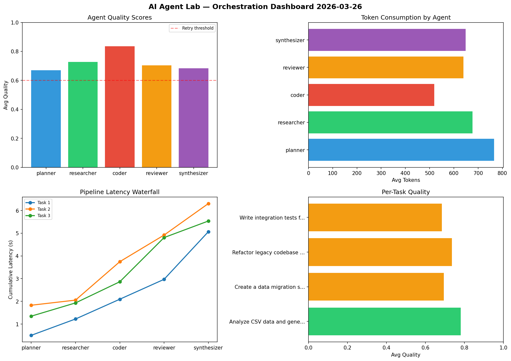

# AI Agent Lab — Orchestration Report 2026-03-26

**Run ID:** `4ec0a9fb45` | **Tasks:** 4 | **Avg Quality:** 0.724

## Aggregate Metrics

| Metric | Value |
|--------|-------|
| avg_latency | 6.122 |
| total_tokens | 13003 |
| avg_quality | 0.724 |

## Delta vs Yesterday

| Metric | Today | Yesterday | Change |
|--------|-------|-----------|--------|
| avg_latency | 6.122 | 6.205 | 📉 -1.3% |
| total_tokens | 13003 | 14953 | 📉 -13.0% |
| avg_quality | 0.724 | 0.757 | 📉 -4.4% |

## Pipeline Results

### Analyze CSV data and generate statistical summary
| Agent | Quality | Latency | Tokens | Status |
|-------|---------|---------|--------|--------|
| planner | 0.78 | 0.503s | 544 | success |
| researcher | 0.9 | 0.72s | 570 | success |
| coder | 0.925 | 0.871s | 486 | success |
| reviewer | 0.603 | 0.876s | 541 | success |
| synthesizer | 0.701 | 2.098s | 655 | success |

### Create a data migration script for schema v2
| Agent | Quality | Latency | Tokens | Status |
|-------|---------|---------|--------|--------|
| planner | 0.589 | 1.829s | 696 | needs_retry |
| researcher | 0.872 | 0.225s | 562 | success |
| coder | 0.56 | 1.693s | 234 | needs_retry |
| reviewer | 0.828 | 1.172s | 593 | success |
| synthesizer | 0.625 | 1.388s | 768 | success |

### Refactor legacy codebase to use dependency injection
| Agent | Quality | Latency | Tokens | Status |
|-------|---------|---------|--------|--------|
| planner | 0.807 | 1.347s | 827 | success |
| researcher | 0.548 | 0.584s | 999 | needs_retry |
| coder | 0.941 | 0.932s | 570 | success |
| reviewer | 0.512 | 1.946s | 484 | needs_retry |
| synthesizer | 0.871 | 0.729s | 391 | success |

### Write integration tests for payment processing module
| Agent | Quality | Latency | Tokens | Status |
|-------|---------|---------|--------|--------|
| planner | 0.506 | 1.32s | 997 | needs_retry |
| researcher | 0.591 | 2.129s | 577 | needs_retry |
| coder | 0.914 | 1.433s | 788 | success |
| reviewer | 0.872 | 1.352s | 941 | success |
| synthesizer | 0.536 | 1.339s | 780 | needs_retry |
