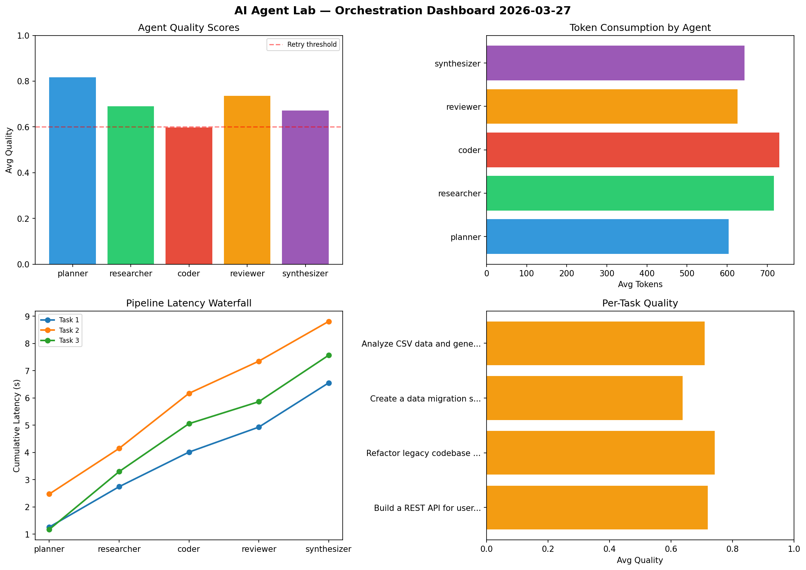

# AI Agent Lab — Orchestration Report 2026-03-27

**Run ID:** `dfccb4b5c2` | **Tasks:** 4 | **Avg Quality:** 0.703

## Aggregate Metrics

| Metric | Value |
|--------|-------|
| avg_latency | 7.2 |
| total_tokens | 13279 |
| avg_quality | 0.703 |

## Delta vs Yesterday

| Metric | Today | Yesterday | Change |
|--------|-------|-----------|--------|
| avg_latency | 7.2 | 6.122 | 📈 17.6% |
| total_tokens | 13279 | 13003 | 📈 2.1% |
| avg_quality | 0.703 | 0.724 | 📉 -2.9% |

## Pipeline Results

### Build a REST API for user authentication
| Agent | Quality | Latency | Tokens | Status |
|-------|---------|---------|--------|--------|
| planner | 0.933 | 1.258s | 580 | success |
| researcher | 0.619 | 1.483s | 369 | success |
| coder | 0.659 | 1.271s | 588 | success |
| reviewer | 0.524 | 0.918s | 644 | needs_retry |
| synthesizer | 0.864 | 1.625s | 245 | success |

### Refactor legacy codebase to use dependency injection
| Agent | Quality | Latency | Tokens | Status |
|-------|---------|---------|--------|--------|
| planner | 0.775 | 2.471s | 868 | success |
| researcher | 0.797 | 1.676s | 457 | success |
| coder | 0.612 | 2.023s | 907 | success |
| reviewer | 0.948 | 1.182s | 768 | success |
| synthesizer | 0.581 | 1.461s | 529 | needs_retry |

### Create a data migration script for schema v2
| Agent | Quality | Latency | Tokens | Status |
|-------|---------|---------|--------|--------|
| planner | 0.58 | 1.17s | 548 | needs_retry |
| researcher | 0.589 | 2.125s | 871 | needs_retry |
| coder | 0.613 | 1.761s | 641 | success |
| reviewer | 0.784 | 0.808s | 606 | success |
| synthesizer | 0.622 | 1.706s | 1090 | success |

### Analyze CSV data and generate statistical summary
| Agent | Quality | Latency | Tokens | Status |
|-------|---------|---------|--------|--------|
| planner | 0.982 | 0.581s | 419 | success |
| researcher | 0.757 | 1.011s | 1170 | success |
| coder | 0.506 | 0.205s | 784 | needs_retry |
| reviewer | 0.69 | 1.588s | 487 | success |
| synthesizer | 0.617 | 2.476s | 708 | success |
