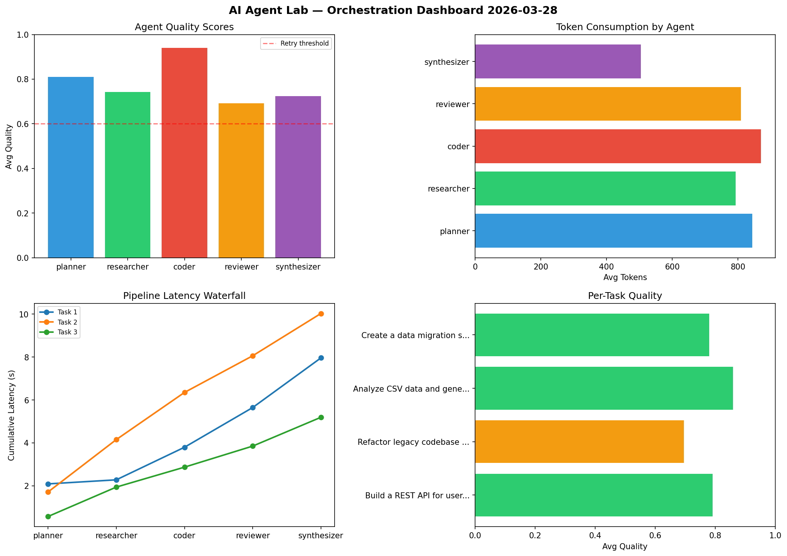

# AI Agent Lab — Orchestration Report 2026-03-28

**Run ID:** `af42bf335b` | **Tasks:** 4 | **Avg Quality:** 0.782

## Aggregate Metrics

| Metric | Value |
|--------|-------|
| avg_latency | 7.054 |
| total_tokens | 15278 |
| avg_quality | 0.782 |

## Delta vs Yesterday

| Metric | Today | Yesterday | Change |
|--------|-------|-----------|--------|
| avg_latency | 7.054 | 7.2 | 📉 -2.0% |
| total_tokens | 15278 | 13279 | 📈 15.1% |
| avg_quality | 0.782 | 0.703 | 📈 11.2% |

## Pipeline Results

### Build a REST API for user authentication
| Agent | Quality | Latency | Tokens | Status |
|-------|---------|---------|--------|--------|
| planner | 0.777 | 2.087s | 1119 | success |
| researcher | 0.855 | 0.189s | 687 | success |
| coder | 0.945 | 1.519s | 789 | success |
| reviewer | 0.761 | 1.852s | 785 | success |
| synthesizer | 0.617 | 2.314s | 415 | success |

### Refactor legacy codebase to use dependency injection
| Agent | Quality | Latency | Tokens | Status |
|-------|---------|---------|--------|--------|
| planner | 0.77 | 1.71s | 483 | success |
| researcher | 0.503 | 2.442s | 766 | needs_retry |
| coder | 0.932 | 2.199s | 883 | success |
| reviewer | 0.502 | 1.71s | 859 | needs_retry |
| synthesizer | 0.772 | 1.971s | 380 | success |

### Analyze CSV data and generate statistical summary
| Agent | Quality | Latency | Tokens | Status |
|-------|---------|---------|--------|--------|
| planner | 0.921 | 0.567s | 887 | success |
| researcher | 0.819 | 1.37s | 889 | success |
| coder | 0.951 | 0.93s | 1009 | success |
| reviewer | 0.701 | 0.982s | 766 | success |
| synthesizer | 0.907 | 1.343s | 441 | success |

### Create a data migration script for schema v2
| Agent | Quality | Latency | Tokens | Status |
|-------|---------|---------|--------|--------|
| planner | 0.771 | 1.293s | 886 | success |
| researcher | 0.794 | 0.31s | 828 | success |
| coder | 0.934 | 0.19s | 798 | success |
| reviewer | 0.801 | 1.532s | 825 | success |
| synthesizer | 0.598 | 1.704s | 783 | needs_retry |
