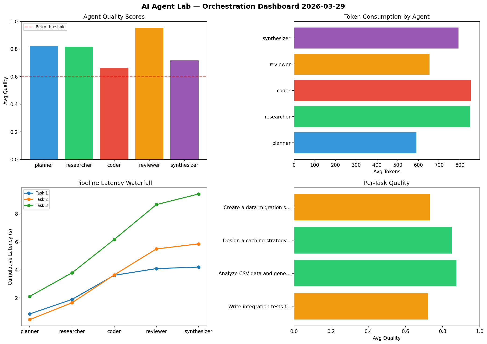

# AI Agent Lab — Orchestration Report 2026-03-29

**Run ID:** `3870cefd96` | **Tasks:** 4 | **Avg Quality:** 0.794

## Aggregate Metrics

| Metric | Value |
|--------|-------|
| avg_latency | 6.702 |
| total_tokens | 14958 |
| avg_quality | 0.794 |

## Delta vs Yesterday

| Metric | Today | Yesterday | Change |
|--------|-------|-----------|--------|
| avg_latency | 6.702 | 7.093 | 📉 -5.5% |
| total_tokens | 14958 | 14317 | 📈 4.5% |
| avg_quality | 0.794 | 0.74 | 📈 7.3% |

## Pipeline Results

### Write integration tests for payment processing module
| Agent | Quality | Latency | Tokens | Status |
|-------|---------|---------|--------|--------|
| planner | 0.587 | 0.86s | 513 | needs_retry |
| researcher | 0.857 | 1.035s | 610 | success |
| coder | 0.52 | 1.72s | 632 | needs_retry |
| reviewer | 0.943 | 0.481s | 667 | success |
| synthesizer | 0.696 | 0.106s | 575 | success |

### Analyze CSV data and generate statistical summary
| Agent | Quality | Latency | Tokens | Status |
|-------|---------|---------|--------|--------|
| planner | 0.962 | 0.46s | 450 | success |
| researcher | 0.916 | 1.194s | 1126 | success |
| coder | 0.748 | 1.989s | 989 | success |
| reviewer | 0.99 | 1.855s | 982 | success |
| synthesizer | 0.752 | 0.361s | 924 | success |

### Design a caching strategy for high-traffic endpoints
| Agent | Quality | Latency | Tokens | Status |
|-------|---------|---------|--------|--------|
| planner | 0.802 | 2.115s | 244 | success |
| researcher | 0.911 | 1.676s | 688 | success |
| coder | 0.873 | 2.379s | 812 | success |
| reviewer | 0.948 | 2.489s | 361 | success |
| synthesizer | 0.714 | 0.76s | 1164 | success |

### Create a data migration script for schema v2
| Agent | Quality | Latency | Tokens | Status |
|-------|---------|---------|--------|--------|
| planner | 0.934 | 1.581s | 1155 | success |
| researcher | 0.586 | 1.222s | 973 | needs_retry |
| coder | 0.503 | 1.653s | 978 | needs_retry |
| reviewer | 0.93 | 2.491s | 604 | success |
| synthesizer | 0.704 | 0.382s | 511 | success |
