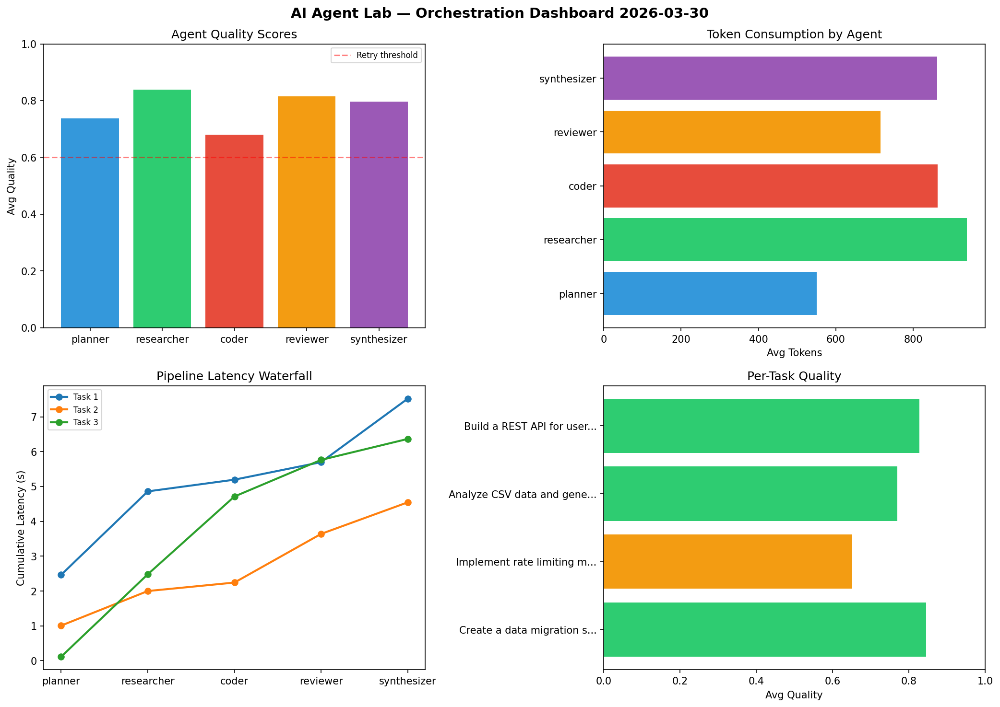

# AI Agent Lab — Orchestration Report 2026-03-30

**Run ID:** `be20501b05` | **Tasks:** 4 | **Avg Quality:** 0.774

## Aggregate Metrics

| Metric | Value |
|--------|-------|
| avg_latency | 6.383 |
| total_tokens | 15716 |
| avg_quality | 0.774 |

## Delta vs Yesterday

| Metric | Today | Yesterday | Change |
|--------|-------|-----------|--------|
| avg_latency | 6.383 | 6.702 | 📉 -4.8% |
| total_tokens | 15716 | 14958 | 📈 5.1% |
| avg_quality | 0.774 | 0.794 | 📉 -2.5% |

## Pipeline Results

### Create a data migration script for schema v2
| Agent | Quality | Latency | Tokens | Status |
|-------|---------|---------|--------|--------|
| planner | 0.78 | 2.464s | 384 | success |
| researcher | 0.991 | 2.396s | 919 | success |
| coder | 0.708 | 0.336s | 831 | success |
| reviewer | 0.905 | 0.503s | 553 | success |
| synthesizer | 0.844 | 1.823s | 685 | success |

### Implement rate limiting middleware
| Agent | Quality | Latency | Tokens | Status |
|-------|---------|---------|--------|--------|
| planner | 0.533 | 1.007s | 790 | needs_retry |
| researcher | 0.96 | 0.993s | 1041 | success |
| coder | 0.538 | 0.243s | 1126 | needs_retry |
| reviewer | 0.546 | 1.397s | 668 | needs_retry |
| synthesizer | 0.681 | 0.906s | 1223 | success |

### Analyze CSV data and generate statistical summary
| Agent | Quality | Latency | Tokens | Status |
|-------|---------|---------|--------|--------|
| planner | 0.64 | 0.114s | 477 | success |
| researcher | 0.745 | 2.366s | 1055 | success |
| coder | 0.789 | 2.233s | 677 | success |
| reviewer | 0.887 | 1.051s | 913 | success |
| synthesizer | 0.79 | 0.602s | 517 | success |

### Build a REST API for user authentication
| Agent | Quality | Latency | Tokens | Status |
|-------|---------|---------|--------|--------|
| planner | 0.998 | 0.144s | 550 | success |
| researcher | 0.662 | 0.922s | 739 | success |
| coder | 0.686 | 1.629s | 817 | success |
| reviewer | 0.924 | 2.004s | 729 | success |
| synthesizer | 0.872 | 2.4s | 1022 | success |
