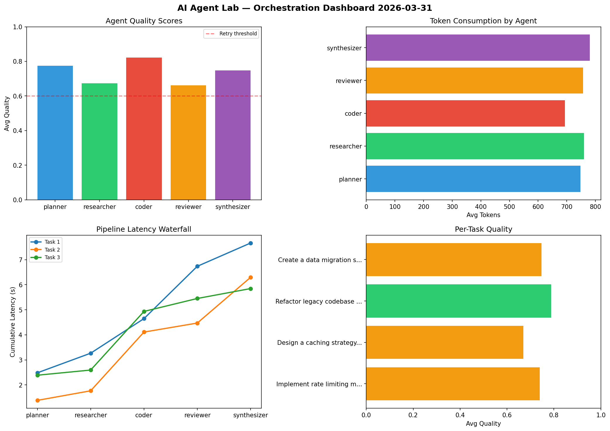

# AI Agent Lab — Orchestration Report 2026-03-31

**Run ID:** `eee09da6a1` | **Tasks:** 4 | **Avg Quality:** 0.736

## Aggregate Metrics

| Metric | Value |
|--------|-------|
| avg_latency | 6.17 |
| total_tokens | 14950 |
| avg_quality | 0.736 |

## Delta vs Yesterday

| Metric | Today | Yesterday | Change |
|--------|-------|-----------|--------|
| avg_latency | 6.17 | 6.12 | 📈 0.8% |
| total_tokens | 14950 | 15221 | 📉 -1.8% |
| avg_quality | 0.736 | 0.764 | 📉 -3.7% |

## Pipeline Results

### Implement rate limiting middleware
| Agent | Quality | Latency | Tokens | Status |
|-------|---------|---------|--------|--------|
| planner | 0.826 | 2.485s | 1020 | success |
| researcher | 0.885 | 0.783s | 1075 | success |
| coder | 0.574 | 1.38s | 723 | needs_retry |
| reviewer | 0.744 | 2.087s | 573 | success |
| synthesizer | 0.667 | 0.929s | 548 | success |

### Design a caching strategy for high-traffic endpoints
| Agent | Quality | Latency | Tokens | Status |
|-------|---------|---------|--------|--------|
| planner | 0.611 | 1.386s | 916 | success |
| researcher | 0.592 | 0.382s | 794 | needs_retry |
| coder | 0.876 | 2.343s | 667 | success |
| reviewer | 0.666 | 0.36s | 634 | success |
| synthesizer | 0.604 | 1.824s | 800 | success |

### Refactor legacy codebase to use dependency injection
| Agent | Quality | Latency | Tokens | Status |
|-------|---------|---------|--------|--------|
| planner | 0.782 | 2.39s | 230 | success |
| researcher | 0.527 | 0.206s | 302 | needs_retry |
| coder | 0.964 | 2.339s | 771 | success |
| reviewer | 0.676 | 0.516s | 863 | success |
| synthesizer | 0.99 | 0.396s | 853 | success |

### Create a data migration script for schema v2
| Agent | Quality | Latency | Tokens | Status |
|-------|---------|---------|--------|--------|
| planner | 0.88 | 1.99s | 824 | success |
| researcher | 0.688 | 0.518s | 868 | success |
| coder | 0.876 | 0.904s | 614 | success |
| reviewer | 0.56 | 1.198s | 956 | needs_retry |
| synthesizer | 0.729 | 0.264s | 919 | success |
