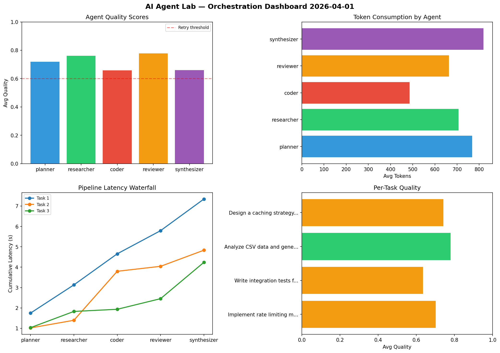

# AI Agent Lab — Orchestration Report 2026-04-01

**Run ID:** `4f624dcf6e` | **Tasks:** 4 | **Avg Quality:** 0.715

## Aggregate Metrics

| Metric | Value |
|--------|-------|
| avg_latency | 5.496 |
| total_tokens | 13778 |
| avg_quality | 0.715 |

## Delta vs Yesterday

| Metric | Today | Yesterday | Change |
|--------|-------|-----------|--------|
| avg_latency | 5.496 | 5.719 | 📉 -3.9% |
| total_tokens | 13778 | 12639 | 📈 9.0% |
| avg_quality | 0.715 | 0.727 | 📉 -1.7% |

## Pipeline Results

### Implement rate limiting middleware
| Agent | Quality | Latency | Tokens | Status |
|-------|---------|---------|--------|--------|
| planner | 0.703 | 1.748s | 564 | success |
| researcher | 0.897 | 1.384s | 691 | success |
| coder | 0.527 | 1.524s | 240 | needs_retry |
| reviewer | 0.807 | 1.136s | 748 | success |
| synthesizer | 0.574 | 1.552s | 771 | needs_retry |

### Write integration tests for payment processing module
| Agent | Quality | Latency | Tokens | Status |
|-------|---------|---------|--------|--------|
| planner | 0.7 | 1.02s | 786 | success |
| researcher | 0.741 | 0.375s | 588 | success |
| coder | 0.542 | 2.404s | 577 | needs_retry |
| reviewer | 0.518 | 0.244s | 482 | needs_retry |
| synthesizer | 0.679 | 0.79s | 1100 | success |

### Analyze CSV data and generate statistical summary
| Agent | Quality | Latency | Tokens | Status |
|-------|---------|---------|--------|--------|
| planner | 0.847 | 1.033s | 839 | success |
| researcher | 0.549 | 0.796s | 804 | needs_retry |
| coder | 0.957 | 0.105s | 467 | success |
| reviewer | 0.929 | 0.521s | 1013 | success |
| synthesizer | 0.616 | 1.783s | 727 | success |

### Design a caching strategy for high-traffic endpoints
| Agent | Quality | Latency | Tokens | Status |
|-------|---------|---------|--------|--------|
| planner | 0.624 | 0.265s | 886 | success |
| researcher | 0.858 | 1.832s | 744 | success |
| coder | 0.607 | 1.164s | 661 | success |
| reviewer | 0.861 | 2.096s | 412 | success |
| synthesizer | 0.767 | 0.213s | 678 | success |
