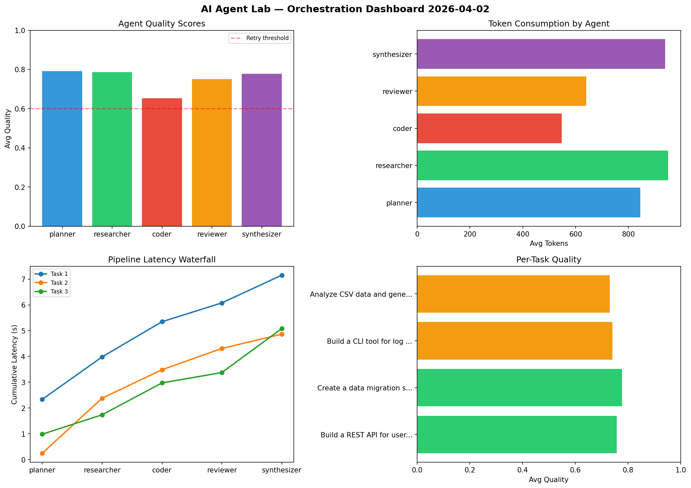

# AI Agent Lab — Orchestration Report 2026-04-02

**Run ID:** `9c5f1a9e1e` | **Tasks:** 4 | **Avg Quality:** 0.752

## Aggregate Metrics

| Metric | Value |
|--------|-------|
| avg_latency | 5.521 |
| total_tokens | 15684 |
| avg_quality | 0.752 |

## Delta vs Yesterday

| Metric | Today | Yesterday | Change |
|--------|-------|-----------|--------|
| avg_latency | 5.521 | 6.394 | 📉 -13.7% |
| total_tokens | 15684 | 15393 | 📈 1.9% |
| avg_quality | 0.752 | 0.7 | 📈 7.4% |

## Pipeline Results

### Build a REST API for user authentication
| Agent | Quality | Latency | Tokens | Status |
|-------|---------|---------|--------|--------|
| planner | 0.961 | 2.334s | 1145 | success |
| researcher | 0.924 | 1.648s | 958 | success |
| coder | 0.535 | 1.365s | 476 | needs_retry |
| reviewer | 0.811 | 0.731s | 827 | success |
| synthesizer | 0.559 | 1.076s | 1114 | needs_retry |

### Create a data migration script for schema v2
| Agent | Quality | Latency | Tokens | Status |
|-------|---------|---------|--------|--------|
| planner | 0.844 | 0.242s | 678 | success |
| researcher | 0.533 | 2.139s | 966 | needs_retry |
| coder | 0.913 | 1.103s | 637 | success |
| reviewer | 0.726 | 0.827s | 659 | success |
| synthesizer | 0.869 | 0.554s | 850 | success |

### Build a CLI tool for log analysis
| Agent | Quality | Latency | Tokens | Status |
|-------|---------|---------|--------|--------|
| planner | 0.73 | 0.983s | 950 | success |
| researcher | 0.836 | 0.754s | 1066 | success |
| coder | 0.556 | 1.236s | 597 | needs_retry |
| reviewer | 0.891 | 0.403s | 478 | success |
| synthesizer | 0.694 | 1.706s | 761 | success |

### Analyze CSV data and generate statistical summary
| Agent | Quality | Latency | Tokens | Status |
|-------|---------|---------|--------|--------|
| planner | 0.63 | 1.669s | 607 | success |
| researcher | 0.854 | 0.858s | 810 | success |
| coder | 0.605 | 0.648s | 480 | success |
| reviewer | 0.578 | 0.391s | 597 | needs_retry |
| synthesizer | 0.99 | 1.416s | 1028 | success |
