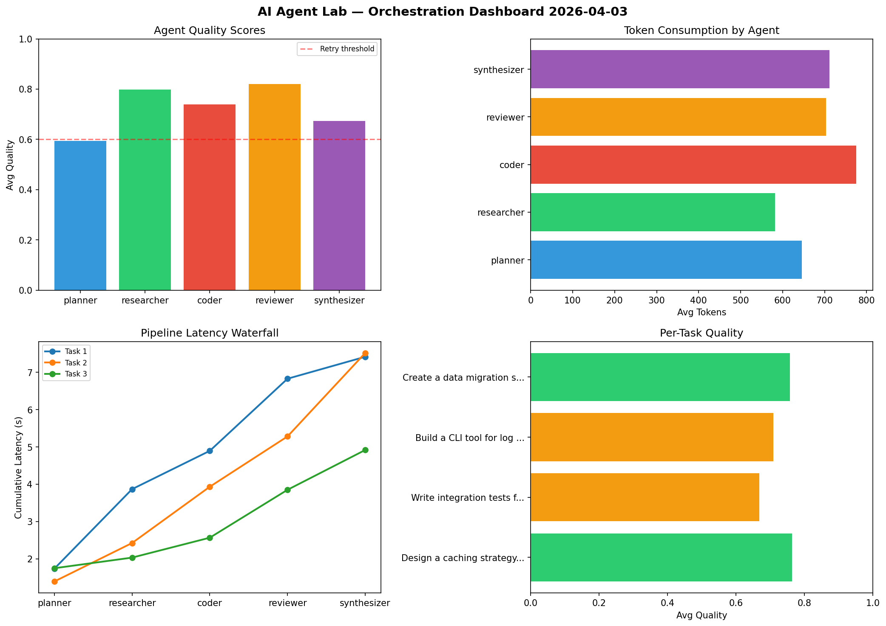

# AI Agent Lab — Orchestration Report 2026-04-03

**Run ID:** `376cd3cdf9` | **Tasks:** 4 | **Avg Quality:** 0.725

## Aggregate Metrics

| Metric | Value |
|--------|-------|
| avg_latency | 6.906 |
| total_tokens | 13671 |
| avg_quality | 0.725 |

## Delta vs Yesterday

| Metric | Today | Yesterday | Change |
|--------|-------|-----------|--------|
| avg_latency | 6.906 | 7.574 | 📉 -8.8% |
| total_tokens | 13671 | 15315 | 📉 -10.7% |
| avg_quality | 0.725 | 0.768 | 📉 -5.6% |

## Pipeline Results

### Design a caching strategy for high-traffic endpoints
| Agent | Quality | Latency | Tokens | Status |
|-------|---------|---------|--------|--------|
| planner | 0.565 | 1.733s | 382 | needs_retry |
| researcher | 0.865 | 2.134s | 562 | success |
| coder | 0.533 | 1.028s | 621 | needs_retry |
| reviewer | 0.864 | 1.935s | 933 | success |
| synthesizer | 0.995 | 0.589s | 859 | success |

### Write integration tests for payment processing module
| Agent | Quality | Latency | Tokens | Status |
|-------|---------|---------|--------|--------|
| planner | 0.572 | 1.39s | 430 | needs_retry |
| researcher | 0.744 | 1.032s | 386 | success |
| coder | 0.617 | 1.51s | 810 | success |
| reviewer | 0.894 | 1.35s | 646 | success |
| synthesizer | 0.512 | 2.239s | 567 | needs_retry |

### Build a CLI tool for log analysis
| Agent | Quality | Latency | Tokens | Status |
|-------|---------|---------|--------|--------|
| planner | 0.703 | 1.746s | 784 | success |
| researcher | 0.815 | 0.285s | 483 | success |
| coder | 0.832 | 0.534s | 504 | success |
| reviewer | 0.595 | 1.285s | 752 | needs_retry |
| synthesizer | 0.606 | 1.068s | 810 | success |

### Create a data migration script for schema v2
| Agent | Quality | Latency | Tokens | Status |
|-------|---------|---------|--------|--------|
| planner | 0.537 | 0.603s | 985 | needs_retry |
| researcher | 0.771 | 0.774s | 897 | success |
| coder | 0.973 | 2.464s | 1168 | success |
| reviewer | 0.929 | 1.675s | 481 | success |
| synthesizer | 0.581 | 2.251s | 611 | needs_retry |
