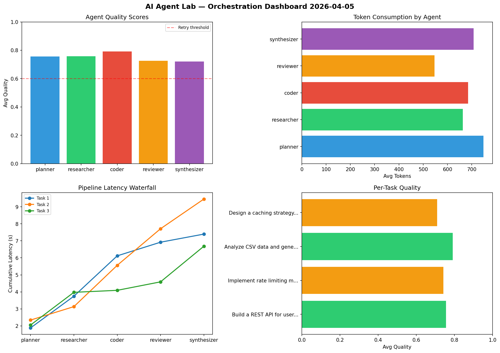

# AI Agent Lab — Orchestration Report 2026-04-05

**Run ID:** `ad7b69b3e0` | **Tasks:** 4 | **Avg Quality:** 0.75

## Aggregate Metrics

| Metric | Value |
|--------|-------|
| avg_latency | 6.84 |
| total_tokens | 13408 |
| avg_quality | 0.75 |

## Delta vs Yesterday

| Metric | Today | Yesterday | Change |
|--------|-------|-----------|--------|
| avg_latency | 6.84 | 6.341 | 📈 7.9% |
| total_tokens | 13408 | 15475 | 📉 -13.4% |
| avg_quality | 0.75 | 0.78 | 📉 -3.8% |

## Pipeline Results

### Build a REST API for user authentication
| Agent | Quality | Latency | Tokens | Status |
|-------|---------|---------|--------|--------|
| planner | 0.57 | 1.884s | 707 | needs_retry |
| researcher | 0.765 | 1.863s | 370 | success |
| coder | 0.916 | 2.371s | 333 | success |
| reviewer | 0.788 | 0.802s | 831 | success |
| synthesizer | 0.742 | 0.476s | 724 | success |

### Implement rate limiting middleware
| Agent | Quality | Latency | Tokens | Status |
|-------|---------|---------|--------|--------|
| planner | 0.679 | 2.344s | 762 | success |
| researcher | 0.668 | 0.79s | 687 | success |
| coder | 0.777 | 2.427s | 803 | success |
| reviewer | 0.776 | 2.15s | 376 | success |
| synthesizer | 0.816 | 1.745s | 978 | success |

### Analyze CSV data and generate statistical summary
| Agent | Quality | Latency | Tokens | Status |
|-------|---------|---------|--------|--------|
| planner | 0.909 | 2.053s | 701 | success |
| researcher | 0.789 | 1.922s | 927 | success |
| coder | 0.837 | 0.117s | 650 | success |
| reviewer | 0.712 | 0.498s | 507 | success |
| synthesizer | 0.708 | 2.093s | 650 | success |

### Design a caching strategy for high-traffic endpoints
| Agent | Quality | Latency | Tokens | Status |
|-------|---------|---------|--------|--------|
| planner | 0.864 | 0.376s | 823 | success |
| researcher | 0.811 | 0.476s | 670 | success |
| coder | 0.634 | 0.531s | 956 | success |
| reviewer | 0.624 | 0.232s | 474 | success |
| synthesizer | 0.617 | 2.209s | 479 | success |
