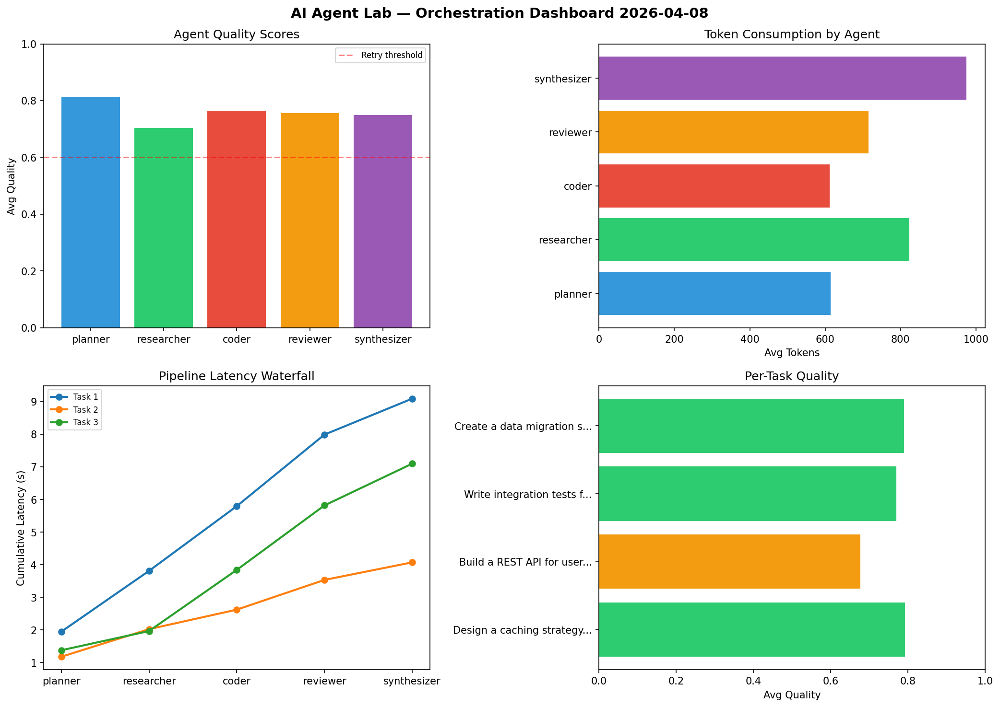

# AI Agent Lab — Orchestration Report 2026-04-08

**Run ID:** `a7caae667f` | **Tasks:** 4 | **Avg Quality:** 0.758

## Aggregate Metrics

| Metric | Value |
|--------|-------|
| avg_latency | 7.002 |
| total_tokens | 14959 |
| avg_quality | 0.758 |

## Delta vs Yesterday

| Metric | Today | Yesterday | Change |
|--------|-------|-----------|--------|
| avg_latency | 7.002 | 7.375 | 📉 -5.1% |
| total_tokens | 14959 | 14602 | 📈 2.4% |
| avg_quality | 0.758 | 0.769 | 📉 -1.4% |

## Pipeline Results

### Design a caching strategy for high-traffic endpoints
| Agent | Quality | Latency | Tokens | Status |
|-------|---------|---------|--------|--------|
| planner | 0.787 | 1.949s | 383 | success |
| researcher | 0.913 | 1.863s | 667 | success |
| coder | 0.911 | 1.983s | 653 | success |
| reviewer | 0.768 | 2.193s | 779 | success |
| synthesizer | 0.586 | 1.101s | 769 | needs_retry |

### Build a REST API for user authentication
| Agent | Quality | Latency | Tokens | Status |
|-------|---------|---------|--------|--------|
| planner | 0.9 | 1.181s | 573 | success |
| researcher | 0.509 | 0.845s | 1298 | needs_retry |
| coder | 0.537 | 0.598s | 577 | needs_retry |
| reviewer | 0.732 | 0.911s | 576 | success |
| synthesizer | 0.707 | 0.538s | 936 | success |

### Write integration tests for payment processing module
| Agent | Quality | Latency | Tokens | Status |
|-------|---------|---------|--------|--------|
| planner | 0.81 | 1.38s | 679 | success |
| researcher | 0.675 | 0.588s | 790 | success |
| coder | 0.721 | 1.874s | 991 | success |
| reviewer | 0.923 | 1.976s | 853 | success |
| synthesizer | 0.719 | 1.279s | 1089 | success |

### Create a data migration script for schema v2
| Agent | Quality | Latency | Tokens | Status |
|-------|---------|---------|--------|--------|
| planner | 0.757 | 1.34s | 823 | success |
| researcher | 0.72 | 1.287s | 539 | success |
| coder | 0.886 | 2.136s | 227 | success |
| reviewer | 0.602 | 1.837s | 651 | success |
| synthesizer | 0.986 | 1.15s | 1106 | success |
