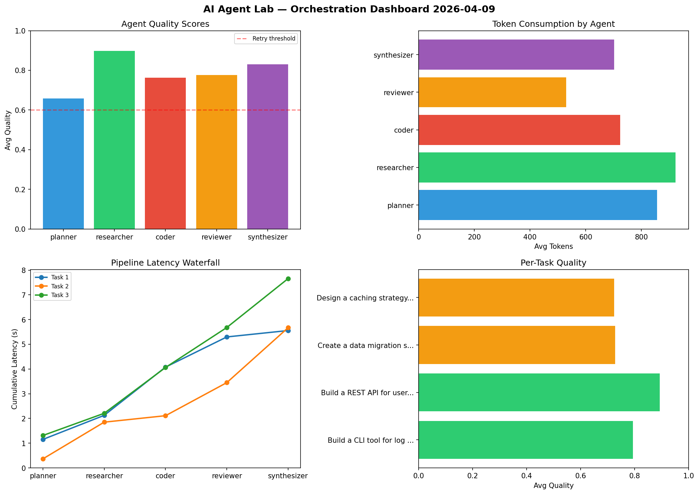

# AI Agent Lab — Orchestration Report 2026-04-09

**Run ID:** `5c4e152352` | **Tasks:** 4 | **Avg Quality:** 0.785

## Aggregate Metrics

| Metric | Value |
|--------|-------|
| avg_latency | 6.597 |
| total_tokens | 14942 |
| avg_quality | 0.785 |

## Delta vs Yesterday

| Metric | Today | Yesterday | Change |
|--------|-------|-----------|--------|
| avg_latency | 6.597 | 6.371 | 📈 3.5% |
| total_tokens | 14942 | 13817 | 📈 8.1% |
| avg_quality | 0.785 | 0.77 | 📈 1.9% |

## Pipeline Results

### Build a CLI tool for log analysis
| Agent | Quality | Latency | Tokens | Status |
|-------|---------|---------|--------|--------|
| planner | 0.699 | 1.151s | 1198 | success |
| researcher | 0.999 | 0.974s | 1053 | success |
| coder | 0.804 | 1.951s | 754 | success |
| reviewer | 0.515 | 1.222s | 257 | needs_retry |
| synthesizer | 0.951 | 0.259s | 473 | success |

### Build a REST API for user authentication
| Agent | Quality | Latency | Tokens | Status |
|-------|---------|---------|--------|--------|
| planner | 0.904 | 0.364s | 701 | success |
| researcher | 0.829 | 1.486s | 506 | success |
| coder | 0.92 | 0.261s | 648 | success |
| reviewer | 0.97 | 1.339s | 639 | success |
| synthesizer | 0.848 | 2.223s | 779 | success |

### Create a data migration script for schema v2
| Agent | Quality | Latency | Tokens | Status |
|-------|---------|---------|--------|--------|
| planner | 0.507 | 1.31s | 887 | needs_retry |
| researcher | 0.817 | 0.898s | 1208 | success |
| coder | 0.815 | 1.853s | 633 | success |
| reviewer | 0.779 | 1.619s | 602 | success |
| synthesizer | 0.724 | 1.98s | 997 | success |

### Design a caching strategy for high-traffic endpoints
| Agent | Quality | Latency | Tokens | Status |
|-------|---------|---------|--------|--------|
| planner | 0.52 | 1.118s | 639 | needs_retry |
| researcher | 0.947 | 2.237s | 926 | success |
| coder | 0.515 | 1.393s | 860 | needs_retry |
| reviewer | 0.841 | 1.542s | 620 | success |
| synthesizer | 0.797 | 1.209s | 562 | success |
