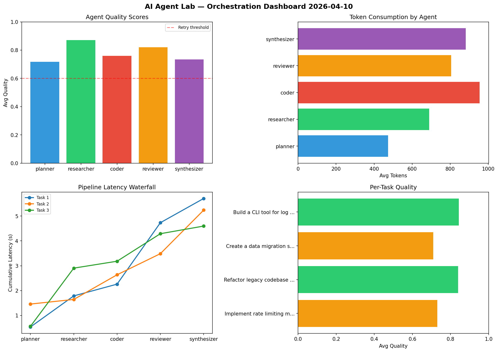

# AI Agent Lab — Orchestration Report 2026-04-10

**Run ID:** `de9b8c682b` | **Tasks:** 4 | **Avg Quality:** 0.78

## Aggregate Metrics

| Metric | Value |
|--------|-------|
| avg_latency | 5.285 |
| total_tokens | 15227 |
| avg_quality | 0.78 |

## Delta vs Yesterday

| Metric | Today | Yesterday | Change |
|--------|-------|-----------|--------|
| avg_latency | 5.285 | 6.854 | 📉 -22.9% |
| total_tokens | 15227 | 14763 | 📈 3.1% |
| avg_quality | 0.78 | 0.769 | 📈 1.4% |

## Pipeline Results

### Implement rate limiting middleware
| Agent | Quality | Latency | Tokens | Status |
|-------|---------|---------|--------|--------|
| planner | 0.812 | 0.537s | 579 | success |
| researcher | 0.811 | 1.25s | 305 | success |
| coder | 0.574 | 0.473s | 542 | needs_retry |
| reviewer | 0.748 | 2.472s | 608 | success |
| synthesizer | 0.706 | 0.974s | 731 | success |

### Refactor legacy codebase to use dependency injection
| Agent | Quality | Latency | Tokens | Status |
|-------|---------|---------|--------|--------|
| planner | 0.915 | 1.459s | 251 | success |
| researcher | 0.945 | 0.186s | 1202 | success |
| coder | 0.964 | 0.992s | 1252 | success |
| reviewer | 0.636 | 0.849s | 916 | success |
| synthesizer | 0.739 | 1.752s | 543 | success |

### Create a data migration script for schema v2
| Agent | Quality | Latency | Tokens | Status |
|-------|---------|---------|--------|--------|
| planner | 0.607 | 0.563s | 451 | success |
| researcher | 0.746 | 2.341s | 870 | success |
| coder | 0.565 | 0.278s | 977 | needs_retry |
| reviewer | 0.922 | 1.107s | 818 | success |
| synthesizer | 0.705 | 0.307s | 1224 | success |

### Build a CLI tool for log analysis
| Agent | Quality | Latency | Tokens | Status |
|-------|---------|---------|--------|--------|
| planner | 0.538 | 0.2s | 615 | needs_retry |
| researcher | 0.979 | 1.891s | 384 | success |
| coder | 0.933 | 0.682s | 1049 | success |
| reviewer | 0.977 | 1.967s | 881 | success |
| synthesizer | 0.787 | 0.859s | 1029 | success |
