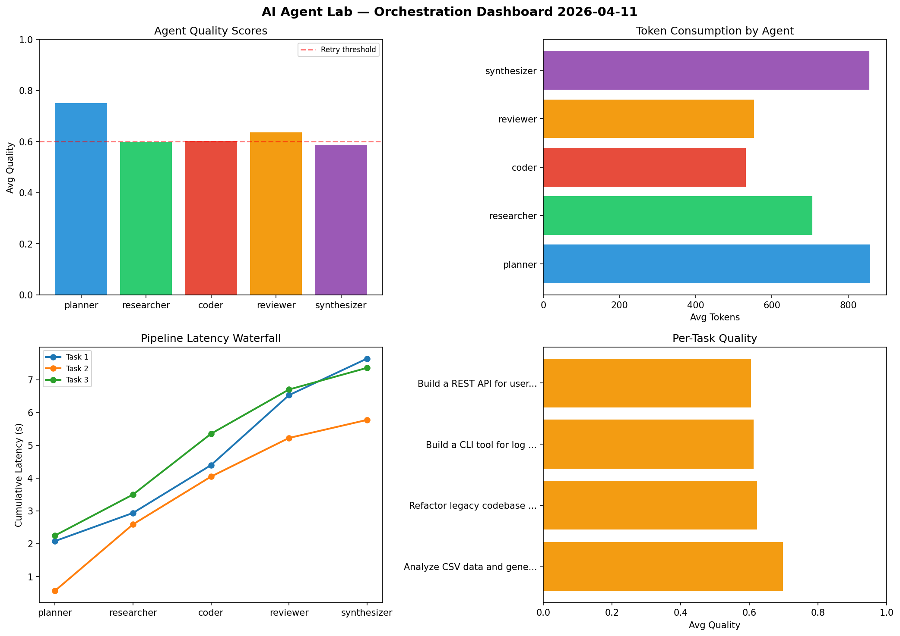

# AI Agent Lab — Orchestration Report 2026-04-11

**Run ID:** `431f09e6b7` | **Tasks:** 4 | **Avg Quality:** 0.635

## Aggregate Metrics

| Metric | Value |
|--------|-------|
| avg_latency | 6.151 |
| total_tokens | 14019 |
| avg_quality | 0.635 |

## Delta vs Yesterday

| Metric | Today | Yesterday | Change |
|--------|-------|-----------|--------|
| avg_latency | 6.151 | 5.285 | 📈 16.4% |
| total_tokens | 14019 | 15227 | 📉 -7.9% |
| avg_quality | 0.635 | 0.78 | 📉 -18.6% |

## Pipeline Results

### Analyze CSV data and generate statistical summary
| Agent | Quality | Latency | Tokens | Status |
|-------|---------|---------|--------|--------|
| planner | 0.973 | 2.08s | 909 | success |
| researcher | 0.718 | 0.858s | 547 | success |
| coder | 0.636 | 1.457s | 524 | success |
| reviewer | 0.638 | 2.134s | 668 | success |
| synthesizer | 0.526 | 1.114s | 756 | needs_retry |

### Refactor legacy codebase to use dependency injection
| Agent | Quality | Latency | Tokens | Status |
|-------|---------|---------|--------|--------|
| planner | 0.644 | 0.565s | 568 | success |
| researcher | 0.592 | 2.025s | 564 | needs_retry |
| coder | 0.523 | 1.456s | 699 | needs_retry |
| reviewer | 0.626 | 1.178s | 394 | success |
| synthesizer | 0.731 | 0.55s | 853 | success |

### Build a CLI tool for log analysis
| Agent | Quality | Latency | Tokens | Status |
|-------|---------|---------|--------|--------|
| planner | 0.768 | 2.25s | 711 | success |
| researcher | 0.555 | 1.249s | 883 | needs_retry |
| coder | 0.519 | 1.853s | 708 | needs_retry |
| reviewer | 0.662 | 1.349s | 552 | success |
| synthesizer | 0.56 | 0.66s | 880 | needs_retry |

### Build a REST API for user authentication
| Agent | Quality | Latency | Tokens | Status |
|-------|---------|---------|--------|--------|
| planner | 0.616 | 0.469s | 1243 | success |
| researcher | 0.529 | 1.15s | 830 | needs_retry |
| coder | 0.729 | 0.147s | 197 | success |
| reviewer | 0.618 | 0.5s | 600 | success |
| synthesizer | 0.532 | 1.56s | 933 | needs_retry |
