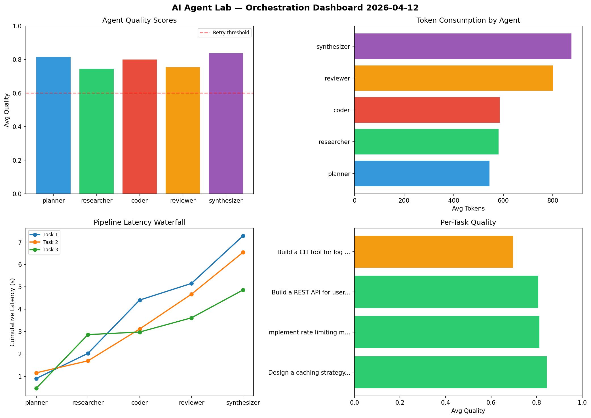

# AI Agent Lab — Orchestration Report 2026-04-12

**Run ID:** `85000628b2` | **Tasks:** 4 | **Avg Quality:** 0.79

## Aggregate Metrics

| Metric | Value |
|--------|-------|
| avg_latency | 6.008 |
| total_tokens | 13546 |
| avg_quality | 0.79 |

## Delta vs Yesterday

| Metric | Today | Yesterday | Change |
|--------|-------|-----------|--------|
| avg_latency | 6.008 | 6.151 | 📉 -2.3% |
| total_tokens | 13546 | 14019 | 📉 -3.4% |
| avg_quality | 0.79 | 0.635 | 📈 24.4% |

## Pipeline Results

### Design a caching strategy for high-traffic endpoints
| Agent | Quality | Latency | Tokens | Status |
|-------|---------|---------|--------|--------|
| planner | 0.832 | 0.898s | 488 | success |
| researcher | 0.952 | 1.125s | 863 | success |
| coder | 0.758 | 2.383s | 428 | success |
| reviewer | 0.762 | 0.743s | 549 | success |
| synthesizer | 0.917 | 2.134s | 1072 | success |

### Implement rate limiting middleware
| Agent | Quality | Latency | Tokens | Status |
|-------|---------|---------|--------|--------|
| planner | 0.896 | 1.152s | 693 | success |
| researcher | 0.677 | 0.535s | 662 | success |
| coder | 0.809 | 1.425s | 390 | success |
| reviewer | 0.696 | 1.555s | 1123 | success |
| synthesizer | 0.984 | 1.878s | 838 | success |

### Build a REST API for user authentication
| Agent | Quality | Latency | Tokens | Status |
|-------|---------|---------|--------|--------|
| planner | 0.919 | 0.46s | 338 | success |
| researcher | 0.589 | 2.4s | 261 | needs_retry |
| coder | 0.966 | 0.116s | 669 | success |
| reviewer | 0.997 | 0.634s | 938 | success |
| synthesizer | 0.562 | 1.249s | 462 | needs_retry |

### Build a CLI tool for log analysis
| Agent | Quality | Latency | Tokens | Status |
|-------|---------|---------|--------|--------|
| planner | 0.613 | 1.54s | 660 | success |
| researcher | 0.76 | 0.779s | 537 | success |
| coder | 0.668 | 1.316s | 854 | success |
| reviewer | 0.562 | 0.962s | 595 | needs_retry |
| synthesizer | 0.883 | 0.75s | 1126 | success |
