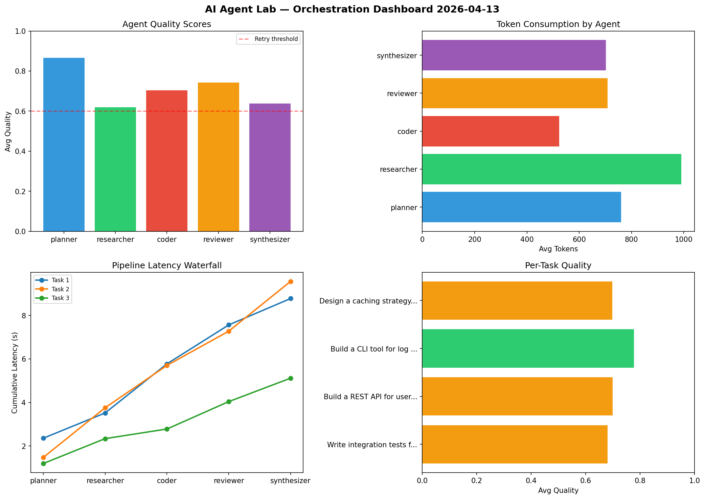

# AI Agent Lab — Orchestration Report 2026-04-13

**Run ID:** `1f13a38c61` | **Tasks:** 4 | **Avg Quality:** 0.714

## Aggregate Metrics

| Metric | Value |
|--------|-------|
| avg_latency | 7.644 |
| total_tokens | 14745 |
| avg_quality | 0.714 |

## Delta vs Yesterday

| Metric | Today | Yesterday | Change |
|--------|-------|-----------|--------|
| avg_latency | 7.644 | 6.008 | 📈 27.2% |
| total_tokens | 14745 | 13546 | 📈 8.9% |
| avg_quality | 0.714 | 0.79 | 📉 -9.6% |

## Pipeline Results

### Write integration tests for payment processing module
| Agent | Quality | Latency | Tokens | Status |
|-------|---------|---------|--------|--------|
| planner | 0.679 | 2.356s | 669 | success |
| researcher | 0.681 | 1.161s | 886 | success |
| coder | 0.581 | 2.256s | 682 | needs_retry |
| reviewer | 0.886 | 1.789s | 713 | success |
| synthesizer | 0.579 | 1.212s | 725 | needs_retry |

### Build a REST API for user authentication
| Agent | Quality | Latency | Tokens | Status |
|-------|---------|---------|--------|--------|
| planner | 0.909 | 1.473s | 835 | success |
| researcher | 0.561 | 2.283s | 956 | needs_retry |
| coder | 0.656 | 1.945s | 579 | success |
| reviewer | 0.803 | 1.574s | 556 | success |
| synthesizer | 0.566 | 2.287s | 551 | needs_retry |

### Build a CLI tool for log analysis
| Agent | Quality | Latency | Tokens | Status |
|-------|---------|---------|--------|--------|
| planner | 0.99 | 1.195s | 820 | success |
| researcher | 0.713 | 1.143s | 1082 | success |
| coder | 0.929 | 0.443s | 215 | success |
| reviewer | 0.617 | 1.259s | 668 | success |
| synthesizer | 0.639 | 1.076s | 594 | success |

### Design a caching strategy for high-traffic endpoints
| Agent | Quality | Latency | Tokens | Status |
|-------|---------|---------|--------|--------|
| planner | 0.887 | 2.004s | 719 | success |
| researcher | 0.519 | 0.278s | 1040 | needs_retry |
| coder | 0.652 | 1.591s | 618 | success |
| reviewer | 0.666 | 1.054s | 898 | success |
| synthesizer | 0.768 | 2.198s | 939 | success |
