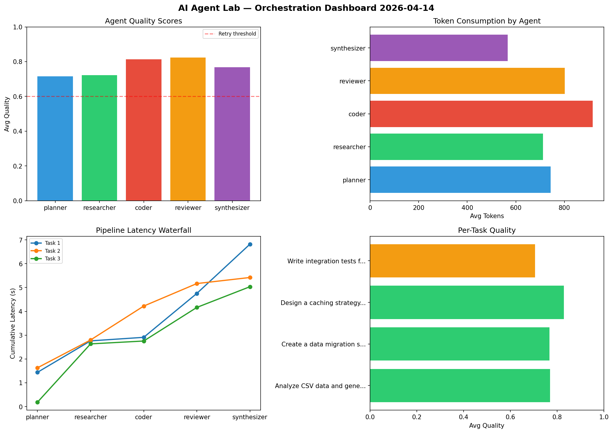

# AI Agent Lab — Orchestration Report 2026-04-14

**Run ID:** `3de32ab030` | **Tasks:** 4 | **Avg Quality:** 0.768

## Aggregate Metrics

| Metric | Value |
|--------|-------|
| avg_latency | 6.219 |
| total_tokens | 14956 |
| avg_quality | 0.768 |

## Delta vs Yesterday

| Metric | Today | Yesterday | Change |
|--------|-------|-----------|--------|
| avg_latency | 6.219 | 7.644 | 📉 -18.6% |
| total_tokens | 14956 | 14745 | 📈 1.4% |
| avg_quality | 0.768 | 0.714 | 📈 7.6% |

## Pipeline Results

### Analyze CSV data and generate statistical summary
| Agent | Quality | Latency | Tokens | Status |
|-------|---------|---------|--------|--------|
| planner | 0.66 | 1.438s | 786 | success |
| researcher | 0.822 | 1.322s | 683 | success |
| coder | 0.726 | 0.148s | 1054 | success |
| reviewer | 0.82 | 1.844s | 840 | success |
| synthesizer | 0.821 | 2.069s | 485 | success |

### Create a data migration script for schema v2
| Agent | Quality | Latency | Tokens | Status |
|-------|---------|---------|--------|--------|
| planner | 0.782 | 1.628s | 840 | success |
| researcher | 0.571 | 1.169s | 700 | needs_retry |
| coder | 0.981 | 1.423s | 349 | success |
| reviewer | 0.977 | 0.946s | 1051 | success |
| synthesizer | 0.531 | 0.255s | 587 | needs_retry |

### Design a caching strategy for high-traffic endpoints
| Agent | Quality | Latency | Tokens | Status |
|-------|---------|---------|--------|--------|
| planner | 0.849 | 0.183s | 485 | success |
| researcher | 0.807 | 2.45s | 665 | success |
| coder | 0.825 | 0.12s | 1190 | success |
| reviewer | 0.874 | 1.411s | 512 | success |
| synthesizer | 0.79 | 0.87s | 812 | success |

### Write integration tests for payment processing module
| Agent | Quality | Latency | Tokens | Status |
|-------|---------|---------|--------|--------|
| planner | 0.574 | 2.129s | 862 | needs_retry |
| researcher | 0.687 | 2.345s | 797 | success |
| coder | 0.719 | 0.934s | 1072 | success |
| reviewer | 0.62 | 1.023s | 803 | success |
| synthesizer | 0.932 | 1.169s | 383 | success |
