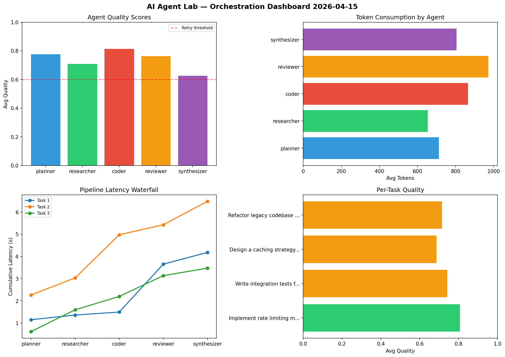

# AI Agent Lab — Orchestration Report 2026-04-15

**Run ID:** `be5ed64478` | **Tasks:** 4 | **Avg Quality:** 0.737

## Aggregate Metrics

| Metric | Value |
|--------|-------|
| avg_latency | 4.559 |
| total_tokens | 16024 |
| avg_quality | 0.737 |

## Delta vs Yesterday

| Metric | Today | Yesterday | Change |
|--------|-------|-----------|--------|
| avg_latency | 4.559 | 6.177 | 📉 -26.2% |
| total_tokens | 16024 | 13783 | 📈 16.3% |
| avg_quality | 0.737 | 0.701 | 📈 5.1% |

## Pipeline Results

### Implement rate limiting middleware
| Agent | Quality | Latency | Tokens | Status |
|-------|---------|---------|--------|--------|
| planner | 0.741 | 1.151s | 448 | success |
| researcher | 0.934 | 0.21s | 811 | success |
| coder | 0.933 | 0.136s | 985 | success |
| reviewer | 0.795 | 2.157s | 1126 | success |
| synthesizer | 0.634 | 0.528s | 945 | success |

### Write integration tests for payment processing module
| Agent | Quality | Latency | Tokens | Status |
|-------|---------|---------|--------|--------|
| planner | 0.957 | 2.263s | 988 | success |
| researcher | 0.549 | 0.771s | 429 | needs_retry |
| coder | 0.723 | 1.944s | 803 | success |
| reviewer | 0.853 | 0.451s | 978 | success |
| synthesizer | 0.63 | 1.057s | 402 | success |

### Design a caching strategy for high-traffic endpoints
| Agent | Quality | Latency | Tokens | Status |
|-------|---------|---------|--------|--------|
| planner | 0.803 | 0.615s | 753 | success |
| researcher | 0.504 | 0.982s | 716 | needs_retry |
| coder | 0.91 | 0.603s | 434 | success |
| reviewer | 0.592 | 0.937s | 965 | needs_retry |
| synthesizer | 0.621 | 0.337s | 1038 | success |

### Refactor legacy codebase to use dependency injection
| Agent | Quality | Latency | Tokens | Status |
|-------|---------|---------|--------|--------|
| planner | 0.604 | 0.252s | 658 | success |
| researcher | 0.846 | 0.211s | 661 | success |
| coder | 0.689 | 0.584s | 1235 | success |
| reviewer | 0.81 | 0.842s | 816 | success |
| synthesizer | 0.622 | 2.205s | 833 | success |
