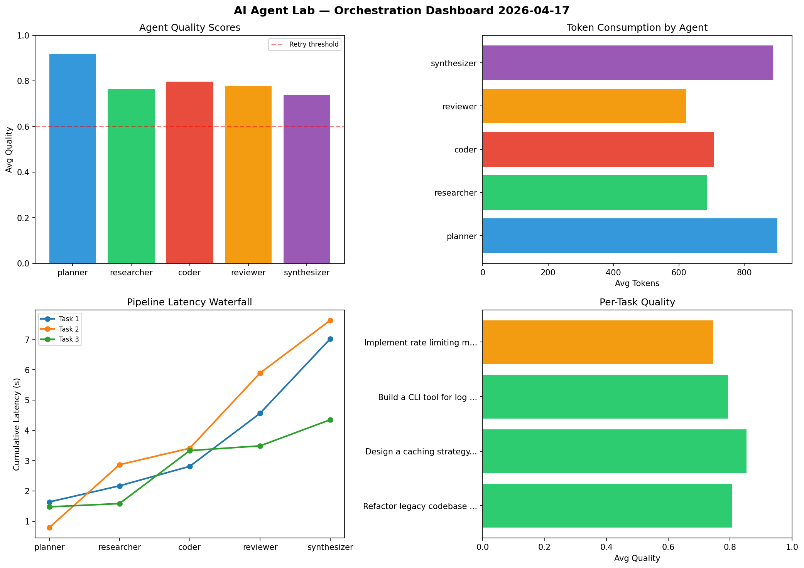

# AI Agent Lab — Orchestration Report 2026-04-17

**Run ID:** `3dcd8b4f3d` | **Tasks:** 4 | **Avg Quality:** 0.799

## Aggregate Metrics

| Metric | Value |
|--------|-------|
| avg_latency | 6.904 |
| total_tokens | 15217 |
| avg_quality | 0.799 |

## Delta vs Yesterday

| Metric | Today | Yesterday | Change |
|--------|-------|-----------|--------|
| avg_latency | 6.904 | 6.76 | 📈 2.1% |
| total_tokens | 15217 | 15890 | 📉 -4.2% |
| avg_quality | 0.799 | 0.755 | 📈 5.8% |

## Pipeline Results

### Refactor legacy codebase to use dependency injection
| Agent | Quality | Latency | Tokens | Status |
|-------|---------|---------|--------|--------|
| planner | 0.985 | 1.637s | 886 | success |
| researcher | 0.948 | 0.533s | 705 | success |
| coder | 0.67 | 0.643s | 1037 | success |
| reviewer | 0.728 | 1.749s | 968 | success |
| synthesizer | 0.699 | 2.461s | 1180 | success |

### Design a caching strategy for high-traffic endpoints
| Agent | Quality | Latency | Tokens | Status |
|-------|---------|---------|--------|--------|
| planner | 0.97 | 0.79s | 770 | success |
| researcher | 0.718 | 2.077s | 745 | success |
| coder | 0.644 | 0.543s | 1101 | success |
| reviewer | 0.999 | 2.481s | 455 | success |
| synthesizer | 0.933 | 1.742s | 805 | success |

### Build a CLI tool for log analysis
| Agent | Quality | Latency | Tokens | Status |
|-------|---------|---------|--------|--------|
| planner | 0.882 | 1.475s | 1273 | success |
| researcher | 0.792 | 0.109s | 522 | success |
| coder | 0.875 | 1.749s | 337 | success |
| reviewer | 0.852 | 0.155s | 514 | success |
| synthesizer | 0.565 | 0.863s | 972 | needs_retry |

### Implement rate limiting middleware
| Agent | Quality | Latency | Tokens | Status |
|-------|---------|---------|--------|--------|
| planner | 0.838 | 1.099s | 673 | success |
| researcher | 0.602 | 1.803s | 773 | success |
| coder | 0.998 | 1.135s | 355 | success |
| reviewer | 0.529 | 2.204s | 550 | needs_retry |
| synthesizer | 0.752 | 2.368s | 596 | success |
