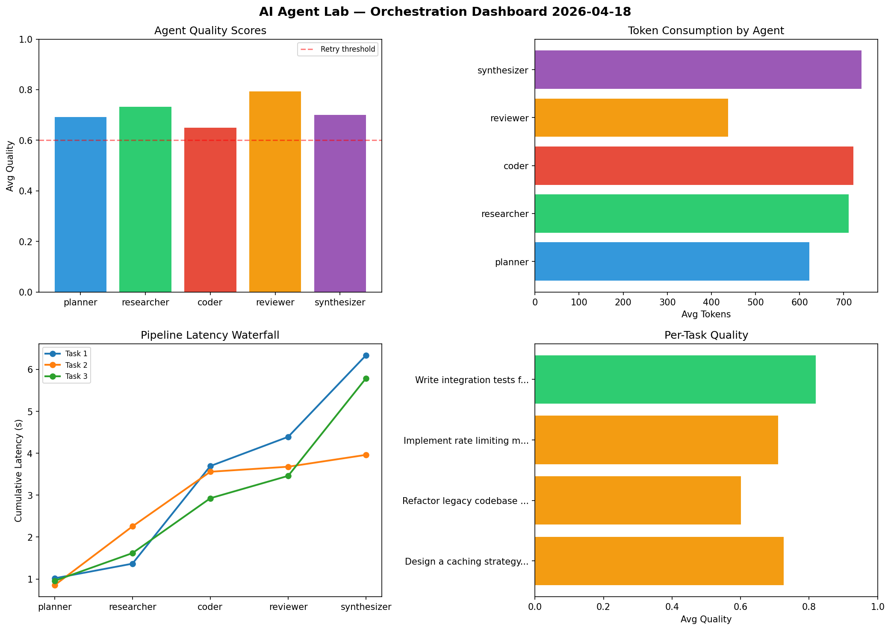

# AI Agent Lab — Orchestration Report 2026-04-18

**Run ID:** `93da8d661b` | **Tasks:** 4 | **Avg Quality:** 0.714

## Aggregate Metrics

| Metric | Value |
|--------|-------|
| avg_latency | 5.006 |
| total_tokens | 12934 |
| avg_quality | 0.714 |

## Delta vs Yesterday

| Metric | Today | Yesterday | Change |
|--------|-------|-----------|--------|
| avg_latency | 5.006 | 7.718 | 📉 -35.1% |
| total_tokens | 12934 | 13546 | 📉 -4.5% |
| avg_quality | 0.714 | 0.756 | 📉 -5.6% |

## Pipeline Results

### Design a caching strategy for high-traffic endpoints
| Agent | Quality | Latency | Tokens | Status |
|-------|---------|---------|--------|--------|
| planner | 0.693 | 1.017s | 975 | success |
| researcher | 0.675 | 0.349s | 855 | success |
| coder | 0.6 | 2.329s | 664 | needs_retry |
| reviewer | 0.763 | 0.697s | 421 | success |
| synthesizer | 0.898 | 1.947s | 952 | success |

### Refactor legacy codebase to use dependency injection
| Agent | Quality | Latency | Tokens | Status |
|-------|---------|---------|--------|--------|
| planner | 0.601 | 0.852s | 520 | success |
| researcher | 0.57 | 1.403s | 887 | needs_retry |
| coder | 0.693 | 1.304s | 1032 | success |
| reviewer | 0.551 | 0.12s | 494 | needs_retry |
| synthesizer | 0.589 | 0.283s | 635 | needs_retry |

### Implement rate limiting middleware
| Agent | Quality | Latency | Tokens | Status |
|-------|---------|---------|--------|--------|
| planner | 0.612 | 0.956s | 367 | success |
| researcher | 0.742 | 0.662s | 532 | success |
| coder | 0.557 | 1.309s | 443 | needs_retry |
| reviewer | 0.989 | 0.534s | 388 | success |
| synthesizer | 0.647 | 2.329s | 1010 | success |

### Write integration tests for payment processing module
| Agent | Quality | Latency | Tokens | Status |
|-------|---------|---------|--------|--------|
| planner | 0.863 | 0.823s | 626 | success |
| researcher | 0.943 | 1.678s | 573 | success |
| coder | 0.752 | 0.467s | 749 | success |
| reviewer | 0.868 | 0.857s | 448 | success |
| synthesizer | 0.668 | 0.106s | 363 | success |
