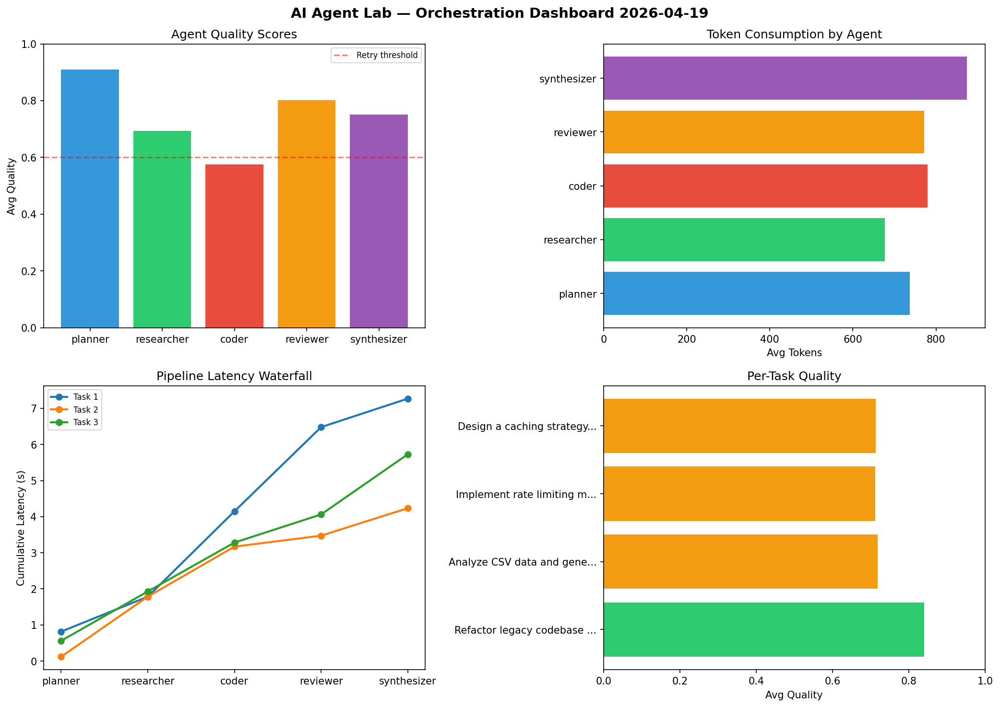

# AI Agent Lab — Orchestration Report 2026-04-19

**Run ID:** `9f5d43ac30` | **Tasks:** 4 | **Avg Quality:** 0.746

## Aggregate Metrics

| Metric | Value |
|--------|-------|
| avg_latency | 6.155 |
| total_tokens | 15358 |
| avg_quality | 0.746 |

## Delta vs Yesterday

| Metric | Today | Yesterday | Change |
|--------|-------|-----------|--------|
| avg_latency | 6.155 | 8.376 | 📉 -26.5% |
| total_tokens | 15358 | 12674 | 📈 21.2% |
| avg_quality | 0.746 | 0.75 | 📉 -0.5% |

## Pipeline Results

### Refactor legacy codebase to use dependency injection
| Agent | Quality | Latency | Tokens | Status |
|-------|---------|---------|--------|--------|
| planner | 0.99 | 0.815s | 736 | success |
| researcher | 0.914 | 0.967s | 869 | success |
| coder | 0.561 | 2.365s | 900 | needs_retry |
| reviewer | 0.761 | 2.333s | 655 | success |
| synthesizer | 0.979 | 0.789s | 1018 | success |

### Analyze CSV data and generate statistical summary
| Agent | Quality | Latency | Tokens | Status |
|-------|---------|---------|--------|--------|
| planner | 0.975 | 0.119s | 858 | success |
| researcher | 0.638 | 1.664s | 377 | success |
| coder | 0.61 | 1.386s | 1002 | success |
| reviewer | 0.761 | 0.304s | 718 | success |
| synthesizer | 0.607 | 0.76s | 1041 | success |

### Implement rate limiting middleware
| Agent | Quality | Latency | Tokens | Status |
|-------|---------|---------|--------|--------|
| planner | 0.892 | 0.56s | 775 | success |
| researcher | 0.553 | 1.368s | 693 | needs_retry |
| coder | 0.553 | 1.354s | 613 | needs_retry |
| reviewer | 0.697 | 0.779s | 739 | success |
| synthesizer | 0.865 | 1.667s | 1207 | success |

### Design a caching strategy for high-traffic endpoints
| Agent | Quality | Latency | Tokens | Status |
|-------|---------|---------|--------|--------|
| planner | 0.779 | 0.903s | 579 | success |
| researcher | 0.669 | 0.681s | 767 | success |
| coder | 0.579 | 1.627s | 604 | needs_retry |
| reviewer | 0.985 | 2.058s | 976 | success |
| synthesizer | 0.553 | 2.12s | 231 | needs_retry |
