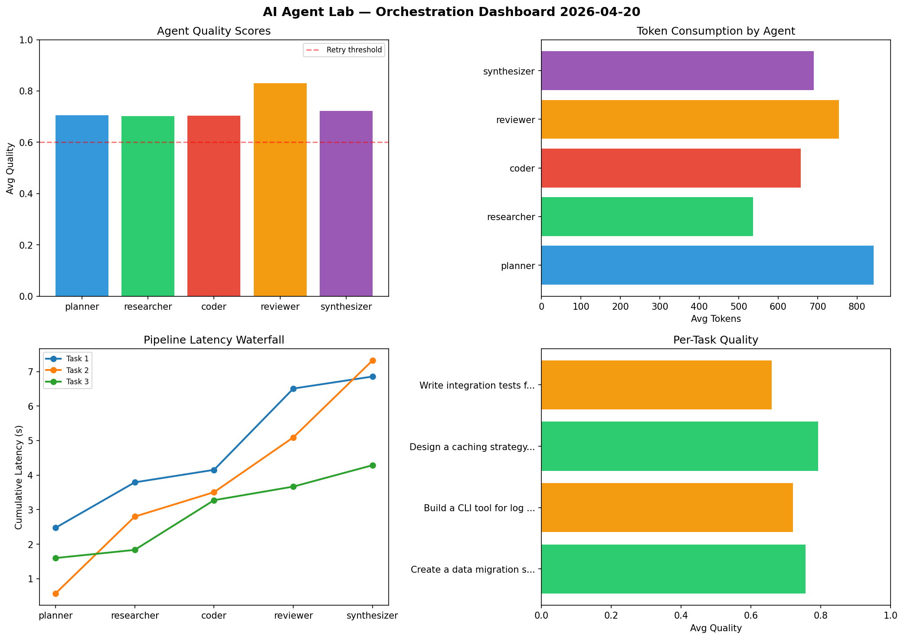

# AI Agent Lab — Orchestration Report 2026-04-20

**Run ID:** `f85649bc49` | **Tasks:** 4 | **Avg Quality:** 0.733

## Aggregate Metrics

| Metric | Value |
|--------|-------|
| avg_latency | 6.57 |
| total_tokens | 13923 |
| avg_quality | 0.733 |

## Delta vs Yesterday

| Metric | Today | Yesterday | Change |
|--------|-------|-----------|--------|
| avg_latency | 6.57 | 8.204 | 📉 -19.9% |
| total_tokens | 13923 | 13802 | 📈 0.9% |
| avg_quality | 0.733 | 0.749 | 📉 -2.1% |

## Pipeline Results

### Create a data migration script for schema v2
| Agent | Quality | Latency | Tokens | Status |
|-------|---------|---------|--------|--------|
| planner | 0.688 | 2.472s | 1038 | success |
| researcher | 0.775 | 1.318s | 840 | success |
| coder | 0.508 | 0.362s | 622 | needs_retry |
| reviewer | 0.897 | 2.354s | 395 | success |
| synthesizer | 0.918 | 0.349s | 1027 | success |

### Build a CLI tool for log analysis
| Agent | Quality | Latency | Tokens | Status |
|-------|---------|---------|--------|--------|
| planner | 0.848 | 0.569s | 615 | success |
| researcher | 0.761 | 2.229s | 301 | success |
| coder | 0.827 | 0.707s | 879 | success |
| reviewer | 0.638 | 1.588s | 576 | success |
| synthesizer | 0.53 | 2.231s | 592 | needs_retry |

### Design a caching strategy for high-traffic endpoints
| Agent | Quality | Latency | Tokens | Status |
|-------|---------|---------|--------|--------|
| planner | 0.775 | 1.598s | 442 | success |
| researcher | 0.699 | 0.236s | 314 | success |
| coder | 0.923 | 1.439s | 661 | success |
| reviewer | 0.969 | 0.394s | 1006 | success |
| synthesizer | 0.6 | 0.62s | 558 | needs_retry |

### Write integration tests for payment processing module
| Agent | Quality | Latency | Tokens | Status |
|-------|---------|---------|--------|--------|
| planner | 0.51 | 2.42s | 1275 | needs_retry |
| researcher | 0.574 | 1.223s | 691 | needs_retry |
| coder | 0.556 | 2.073s | 468 | needs_retry |
| reviewer | 0.819 | 1.595s | 1037 | success |
| synthesizer | 0.842 | 0.504s | 586 | success |
