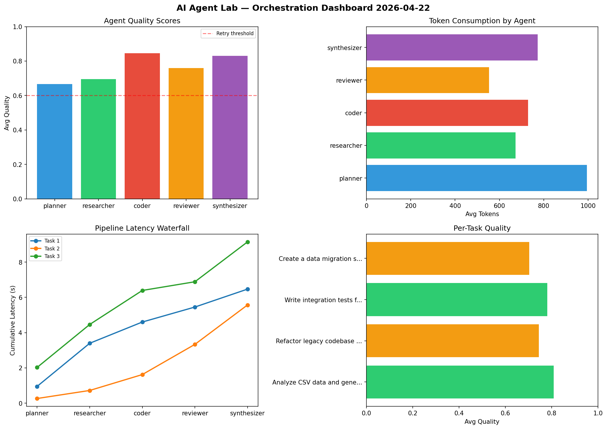

# AI Agent Lab — Orchestration Report 2026-04-22

**Run ID:** `e13555686c` | **Tasks:** 4 | **Avg Quality:** 0.759

## Aggregate Metrics

| Metric | Value |
|--------|-------|
| avg_latency | 7.054 |
| total_tokens | 14894 |
| avg_quality | 0.759 |

## Delta vs Yesterday

| Metric | Today | Yesterday | Change |
|--------|-------|-----------|--------|
| avg_latency | 7.054 | 5.967 | 📈 18.2% |
| total_tokens | 14894 | 14569 | 📈 2.2% |
| avg_quality | 0.759 | 0.811 | 📉 -6.4% |

## Pipeline Results

### Analyze CSV data and generate statistical summary
| Agent | Quality | Latency | Tokens | Status |
|-------|---------|---------|--------|--------|
| planner | 0.684 | 0.951s | 807 | success |
| researcher | 0.833 | 2.446s | 930 | success |
| coder | 0.931 | 1.204s | 807 | success |
| reviewer | 0.637 | 0.85s | 440 | success |
| synthesizer | 0.96 | 1.016s | 780 | success |

### Refactor legacy codebase to use dependency injection
| Agent | Quality | Latency | Tokens | Status |
|-------|---------|---------|--------|--------|
| planner | 0.851 | 0.266s | 1173 | success |
| researcher | 0.742 | 0.456s | 619 | success |
| coder | 0.732 | 0.901s | 926 | success |
| reviewer | 0.778 | 1.712s | 641 | success |
| synthesizer | 0.623 | 2.234s | 573 | success |

### Write integration tests for payment processing module
| Agent | Quality | Latency | Tokens | Status |
|-------|---------|---------|--------|--------|
| planner | 0.623 | 2.026s | 946 | success |
| researcher | 0.539 | 2.436s | 332 | needs_retry |
| coder | 0.948 | 1.929s | 709 | success |
| reviewer | 0.886 | 0.493s | 650 | success |
| synthesizer | 0.909 | 2.26s | 708 | success |

### Create a data migration script for schema v2
| Agent | Quality | Latency | Tokens | Status |
|-------|---------|---------|--------|--------|
| planner | 0.505 | 1.731s | 1052 | needs_retry |
| researcher | 0.668 | 2.186s | 811 | success |
| coder | 0.77 | 0.349s | 476 | success |
| reviewer | 0.74 | 1.109s | 484 | success |
| synthesizer | 0.832 | 1.66s | 1030 | success |
