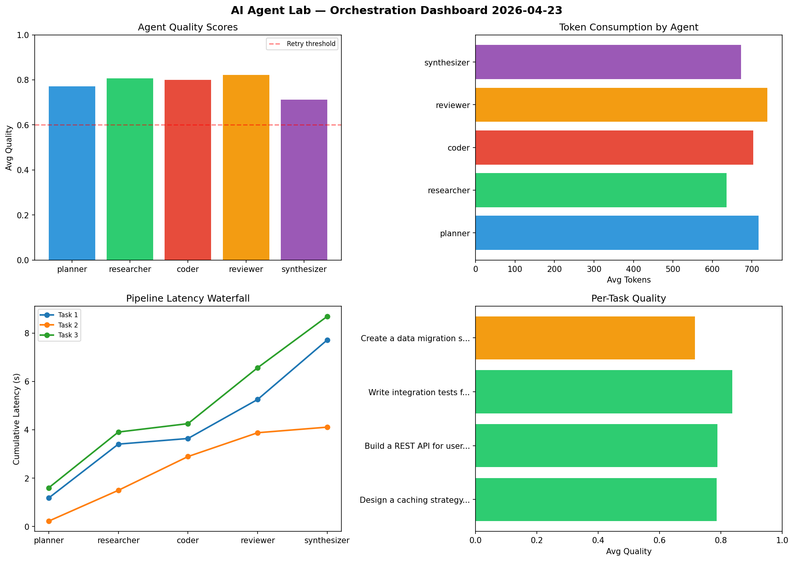

# AI Agent Lab — Orchestration Report 2026-04-23

**Run ID:** `1e311782a7` | **Tasks:** 4 | **Avg Quality:** 0.782

## Aggregate Metrics

| Metric | Value |
|--------|-------|
| avg_latency | 7.175 |
| total_tokens | 13873 |
| avg_quality | 0.782 |

## Delta vs Yesterday

| Metric | Today | Yesterday | Change |
|--------|-------|-----------|--------|
| avg_latency | 7.175 | 5.841 | 📈 22.8% |
| total_tokens | 13873 | 14234 | 📉 -2.5% |
| avg_quality | 0.782 | 0.754 | 📈 3.7% |

## Pipeline Results

### Design a caching strategy for high-traffic endpoints
| Agent | Quality | Latency | Tokens | Status |
|-------|---------|---------|--------|--------|
| planner | 0.74 | 1.175s | 733 | success |
| researcher | 0.915 | 2.231s | 474 | success |
| coder | 0.759 | 0.233s | 284 | success |
| reviewer | 0.937 | 1.616s | 862 | success |
| synthesizer | 0.584 | 2.466s | 340 | needs_retry |

### Build a REST API for user authentication
| Agent | Quality | Latency | Tokens | Status |
|-------|---------|---------|--------|--------|
| planner | 0.95 | 0.219s | 994 | success |
| researcher | 0.676 | 1.275s | 256 | success |
| coder | 0.793 | 1.398s | 881 | success |
| reviewer | 0.839 | 0.986s | 668 | success |
| synthesizer | 0.688 | 0.231s | 868 | success |

### Write integration tests for payment processing module
| Agent | Quality | Latency | Tokens | Status |
|-------|---------|---------|--------|--------|
| planner | 0.895 | 1.596s | 612 | success |
| researcher | 0.718 | 2.31s | 1017 | success |
| coder | 0.692 | 0.348s | 438 | success |
| reviewer | 0.919 | 2.315s | 497 | success |
| synthesizer | 0.964 | 2.127s | 969 | success |

### Create a data migration script for schema v2
| Agent | Quality | Latency | Tokens | Status |
|-------|---------|---------|--------|--------|
| planner | 0.503 | 2.077s | 528 | needs_retry |
| researcher | 0.917 | 2.102s | 797 | success |
| coder | 0.953 | 1.114s | 1210 | success |
| reviewer | 0.594 | 0.904s | 932 | needs_retry |
| synthesizer | 0.612 | 1.975s | 513 | success |
