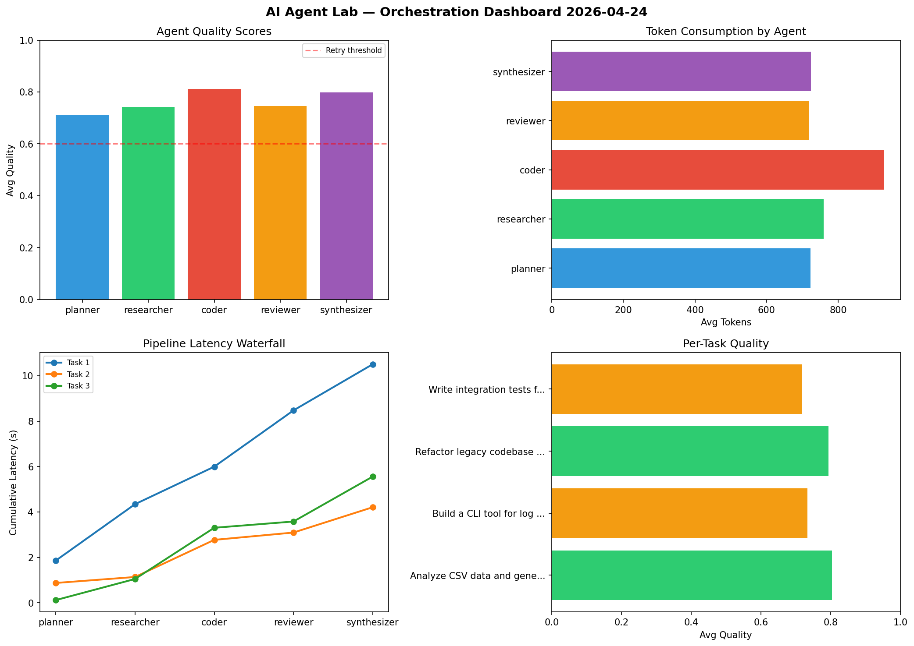

# AI Agent Lab — Orchestration Report 2026-04-24

**Run ID:** `791ff8712c` | **Tasks:** 4 | **Avg Quality:** 0.762

## Aggregate Metrics

| Metric | Value |
|--------|-------|
| avg_latency | 7.116 |
| total_tokens | 15402 |
| avg_quality | 0.762 |

## Delta vs Yesterday

| Metric | Today | Yesterday | Change |
|--------|-------|-----------|--------|
| avg_latency | 7.116 | 7.175 | 📉 -0.8% |
| total_tokens | 15402 | 13873 | 📈 11.0% |
| avg_quality | 0.762 | 0.782 | 📉 -2.6% |

## Pipeline Results

### Analyze CSV data and generate statistical summary
| Agent | Quality | Latency | Tokens | Status |
|-------|---------|---------|--------|--------|
| planner | 0.857 | 1.859s | 889 | success |
| researcher | 0.769 | 2.484s | 814 | success |
| coder | 0.943 | 1.652s | 912 | success |
| reviewer | 0.542 | 2.48s | 419 | needs_retry |
| synthesizer | 0.907 | 2.033s | 561 | success |

### Build a CLI tool for log analysis
| Agent | Quality | Latency | Tokens | Status |
|-------|---------|---------|--------|--------|
| planner | 0.554 | 0.871s | 836 | needs_retry |
| researcher | 0.874 | 0.264s | 771 | success |
| coder | 0.601 | 1.635s | 947 | success |
| reviewer | 0.917 | 0.323s | 753 | success |
| synthesizer | 0.717 | 1.115s | 1052 | success |

### Refactor legacy codebase to use dependency injection
| Agent | Quality | Latency | Tokens | Status |
|-------|---------|---------|--------|--------|
| planner | 0.797 | 0.117s | 647 | success |
| researcher | 0.813 | 0.93s | 622 | success |
| coder | 0.723 | 2.256s | 1245 | success |
| reviewer | 0.973 | 0.276s | 680 | success |
| synthesizer | 0.664 | 1.979s | 731 | success |

### Write integration tests for payment processing module
| Agent | Quality | Latency | Tokens | Status |
|-------|---------|---------|--------|--------|
| planner | 0.631 | 1.989s | 516 | success |
| researcher | 0.517 | 2.325s | 829 | needs_retry |
| coder | 0.98 | 0.186s | 604 | success |
| reviewer | 0.554 | 2.373s | 1024 | needs_retry |
| synthesizer | 0.907 | 1.318s | 550 | success |
