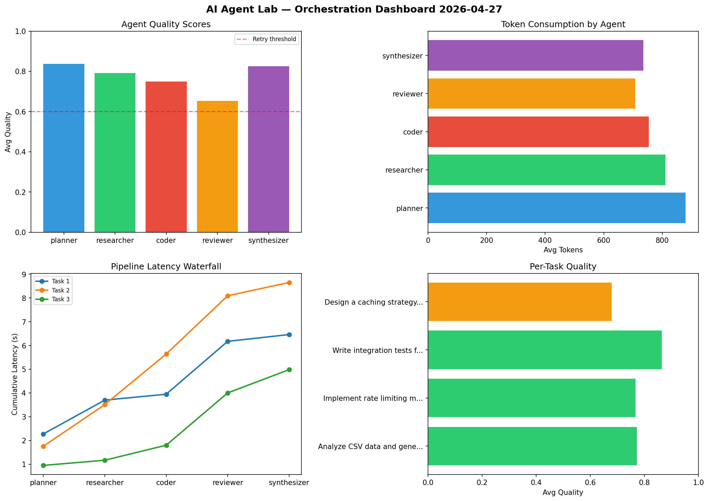

# AI Agent Lab — Orchestration Report 2026-04-27

**Run ID:** `32d881dad8` | **Tasks:** 4 | **Avg Quality:** 0.771

## Aggregate Metrics

| Metric | Value |
|--------|-------|
| avg_latency | 6.151 |
| total_tokens | 15544 |
| avg_quality | 0.771 |

## Delta vs Yesterday

| Metric | Today | Yesterday | Change |
|--------|-------|-----------|--------|
| avg_latency | 6.151 | 6.838 | 📉 -10.0% |
| total_tokens | 15544 | 13614 | 📈 14.2% |
| avg_quality | 0.771 | 0.782 | 📉 -1.4% |

## Pipeline Results

### Analyze CSV data and generate statistical summary
| Agent | Quality | Latency | Tokens | Status |
|-------|---------|---------|--------|--------|
| planner | 0.987 | 2.272s | 1137 | success |
| researcher | 0.806 | 1.425s | 885 | success |
| coder | 0.685 | 0.249s | 888 | success |
| reviewer | 0.586 | 2.227s | 856 | needs_retry |
| synthesizer | 0.797 | 0.286s | 556 | success |

### Implement rate limiting middleware
| Agent | Quality | Latency | Tokens | Status |
|-------|---------|---------|--------|--------|
| planner | 0.78 | 1.753s | 803 | success |
| researcher | 0.81 | 1.756s | 725 | success |
| coder | 0.753 | 2.13s | 661 | success |
| reviewer | 0.618 | 2.454s | 414 | success |
| synthesizer | 0.879 | 0.559s | 994 | success |

### Write integration tests for payment processing module
| Agent | Quality | Latency | Tokens | Status |
|-------|---------|---------|--------|--------|
| planner | 0.874 | 0.948s | 632 | success |
| researcher | 0.874 | 0.217s | 784 | success |
| coder | 0.947 | 0.634s | 870 | success |
| reviewer | 0.787 | 2.201s | 757 | success |
| synthesizer | 0.836 | 0.981s | 908 | success |

### Design a caching strategy for high-traffic endpoints
| Agent | Quality | Latency | Tokens | Status |
|-------|---------|---------|--------|--------|
| planner | 0.707 | 1.217s | 945 | success |
| researcher | 0.674 | 0.372s | 850 | success |
| coder | 0.611 | 0.312s | 596 | success |
| reviewer | 0.621 | 0.954s | 802 | success |
| synthesizer | 0.788 | 1.659s | 481 | success |
