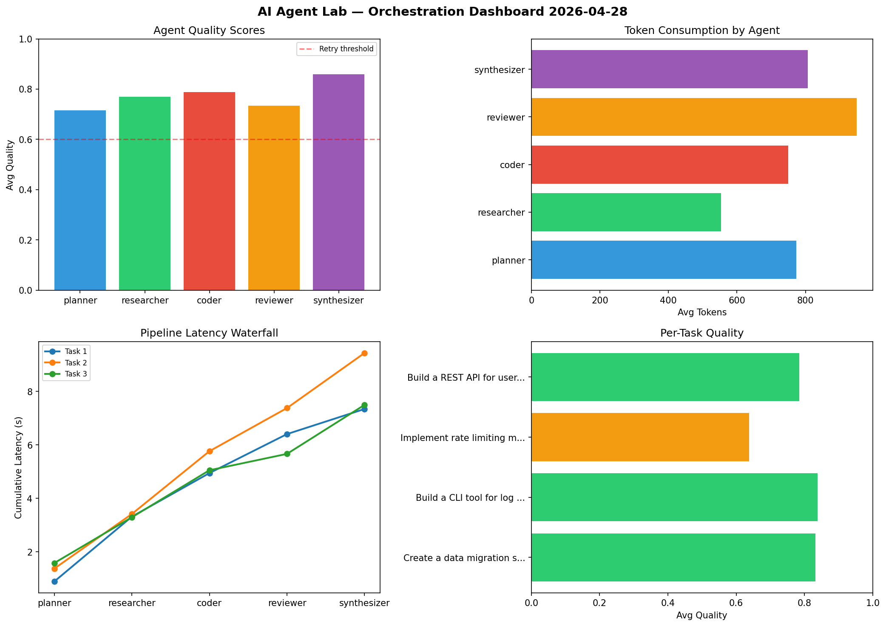

# AI Agent Lab — Orchestration Report 2026-04-28

**Run ID:** `a9310f91db` | **Tasks:** 4 | **Avg Quality:** 0.773

## Aggregate Metrics

| Metric | Value |
|--------|-------|
| avg_latency | 8.415 |
| total_tokens | 15328 |
| avg_quality | 0.773 |

## Delta vs Yesterday

| Metric | Today | Yesterday | Change |
|--------|-------|-----------|--------|
| avg_latency | 8.415 | 7.163 | 📈 17.5% |
| total_tokens | 15328 | 13224 | 📈 15.9% |
| avg_quality | 0.773 | 0.738 | 📈 4.7% |

## Pipeline Results

### Create a data migration script for schema v2
| Agent | Quality | Latency | Tokens | Status |
|-------|---------|---------|--------|--------|
| planner | 0.693 | 0.889s | 823 | success |
| researcher | 0.661 | 2.425s | 969 | success |
| coder | 0.951 | 1.63s | 862 | success |
| reviewer | 0.897 | 1.458s | 736 | success |
| synthesizer | 0.957 | 0.939s | 1053 | success |

### Build a CLI tool for log analysis
| Agent | Quality | Latency | Tokens | Status |
|-------|---------|---------|--------|--------|
| planner | 0.943 | 1.371s | 872 | success |
| researcher | 0.871 | 2.043s | 268 | success |
| coder | 0.851 | 2.348s | 725 | success |
| reviewer | 0.56 | 1.614s | 1250 | needs_retry |
| synthesizer | 0.97 | 2.06s | 568 | success |

### Implement rate limiting middleware
| Agent | Quality | Latency | Tokens | Status |
|-------|---------|---------|--------|--------|
| planner | 0.508 | 1.58s | 1064 | needs_retry |
| researcher | 0.717 | 1.711s | 664 | success |
| coder | 0.704 | 1.759s | 1019 | success |
| reviewer | 0.59 | 0.612s | 1200 | needs_retry |
| synthesizer | 0.669 | 1.833s | 756 | success |

### Build a REST API for user authentication
| Agent | Quality | Latency | Tokens | Status |
|-------|---------|---------|--------|--------|
| planner | 0.716 | 2.143s | 336 | success |
| researcher | 0.832 | 2.228s | 314 | success |
| coder | 0.648 | 1.921s | 392 | success |
| reviewer | 0.889 | 2.333s | 609 | success |
| synthesizer | 0.838 | 0.761s | 848 | success |
