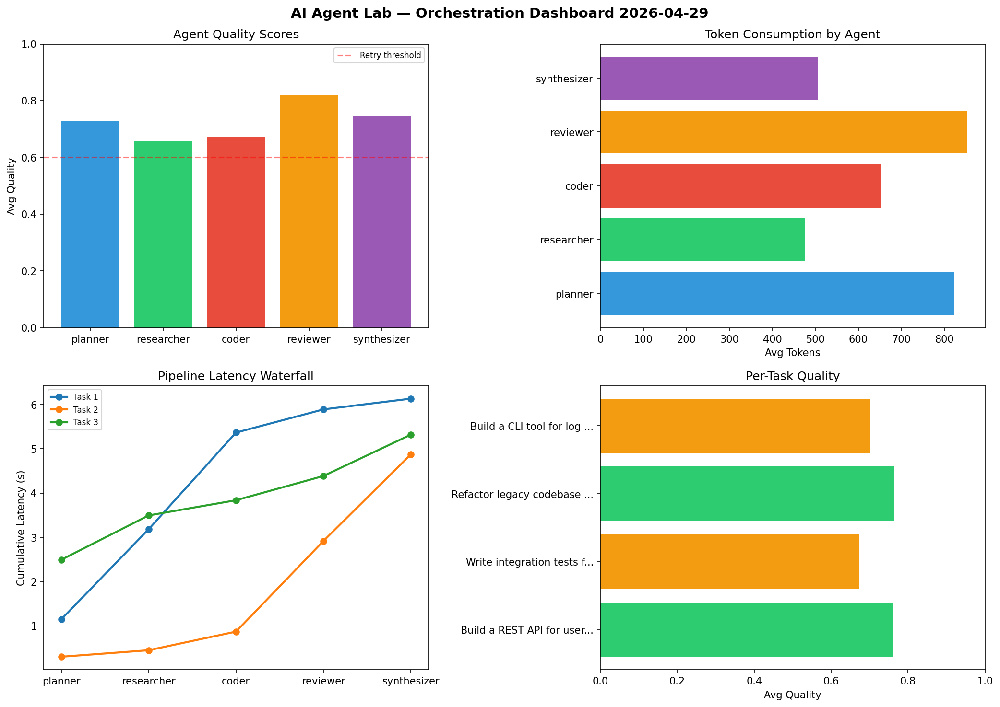

# AI Agent Lab — Orchestration Report 2026-04-29

**Run ID:** `89a2477261` | **Tasks:** 4 | **Avg Quality:** 0.724

## Aggregate Metrics

| Metric | Value |
|--------|-------|
| avg_latency | 5.83 |
| total_tokens | 13237 |
| avg_quality | 0.724 |

## Delta vs Yesterday

| Metric | Today | Yesterday | Change |
|--------|-------|-----------|--------|
| avg_latency | 5.83 | 7.051 | 📉 -17.3% |
| total_tokens | 13237 | 14455 | 📉 -8.4% |
| avg_quality | 0.724 | 0.746 | 📉 -2.9% |

## Pipeline Results

### Build a REST API for user authentication
| Agent | Quality | Latency | Tokens | Status |
|-------|---------|---------|--------|--------|
| planner | 0.579 | 1.147s | 1091 | needs_retry |
| researcher | 0.815 | 2.037s | 291 | success |
| coder | 0.569 | 2.184s | 812 | needs_retry |
| reviewer | 0.893 | 0.524s | 866 | success |
| synthesizer | 0.944 | 0.243s | 283 | success |

### Write integration tests for payment processing module
| Agent | Quality | Latency | Tokens | Status |
|-------|---------|---------|--------|--------|
| planner | 0.9 | 0.302s | 793 | success |
| researcher | 0.552 | 0.147s | 419 | needs_retry |
| coder | 0.571 | 0.421s | 580 | needs_retry |
| reviewer | 0.713 | 2.048s | 947 | success |
| synthesizer | 0.631 | 1.957s | 721 | success |

### Refactor legacy codebase to use dependency injection
| Agent | Quality | Latency | Tokens | Status |
|-------|---------|---------|--------|--------|
| planner | 0.608 | 2.493s | 844 | success |
| researcher | 0.632 | 1.003s | 569 | success |
| coder | 0.82 | 0.343s | 353 | success |
| reviewer | 0.904 | 0.548s | 680 | success |
| synthesizer | 0.853 | 0.934s | 557 | success |

### Build a CLI tool for log analysis
| Agent | Quality | Latency | Tokens | Status |
|-------|---------|---------|--------|--------|
| planner | 0.822 | 1.009s | 563 | success |
| researcher | 0.635 | 1.727s | 625 | success |
| coder | 0.734 | 0.581s | 870 | success |
| reviewer | 0.762 | 1.343s | 915 | success |
| synthesizer | 0.551 | 2.33s | 458 | needs_retry |
