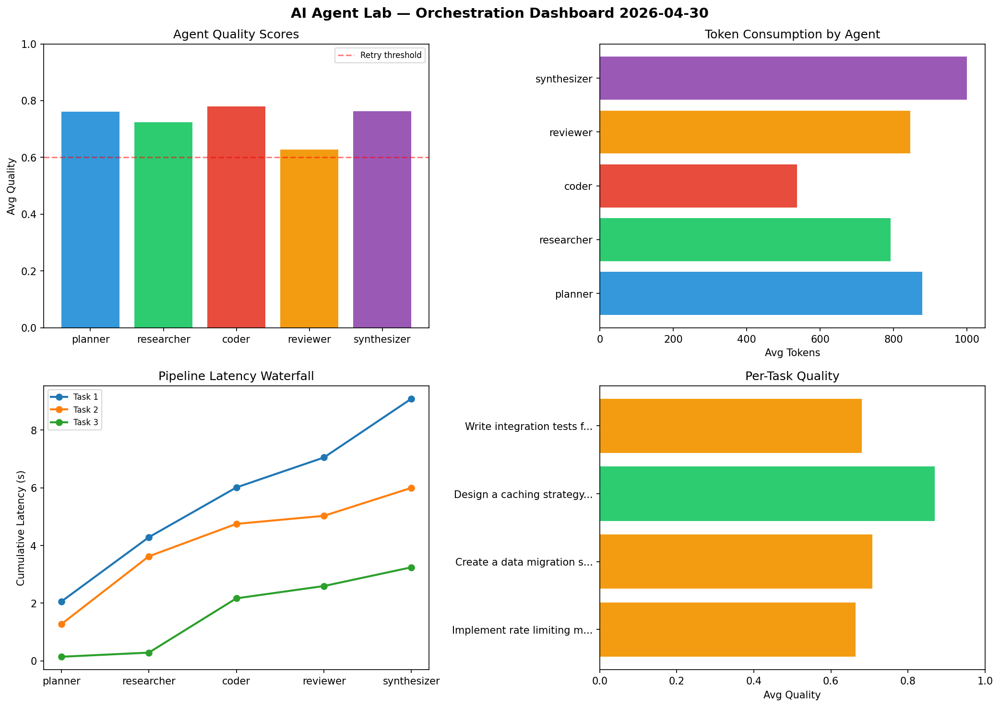

# AI Agent Lab — Orchestration Report 2026-04-30

**Run ID:** `114b4068be` | **Tasks:** 4 | **Avg Quality:** 0.731

## Aggregate Metrics

| Metric | Value |
|--------|-------|
| avg_latency | 5.983 |
| total_tokens | 16205 |
| avg_quality | 0.731 |

## Delta vs Yesterday

| Metric | Today | Yesterday | Change |
|--------|-------|-----------|--------|
| avg_latency | 5.983 | 5.83 | 📈 2.6% |
| total_tokens | 16205 | 13237 | 📈 22.4% |
| avg_quality | 0.731 | 0.724 | 📈 1.0% |

## Pipeline Results

### Implement rate limiting middleware
| Agent | Quality | Latency | Tokens | Status |
|-------|---------|---------|--------|--------|
| planner | 0.777 | 2.054s | 762 | success |
| researcher | 0.539 | 2.232s | 747 | needs_retry |
| coder | 0.875 | 1.727s | 658 | success |
| reviewer | 0.527 | 1.039s | 908 | needs_retry |
| synthesizer | 0.604 | 2.042s | 1156 | success |

### Create a data migration script for schema v2
| Agent | Quality | Latency | Tokens | Status |
|-------|---------|---------|--------|--------|
| planner | 0.553 | 1.269s | 675 | needs_retry |
| researcher | 0.722 | 2.355s | 495 | success |
| coder | 0.629 | 1.126s | 464 | success |
| reviewer | 0.677 | 0.279s | 939 | success |
| synthesizer | 0.961 | 0.971s | 1210 | success |

### Design a caching strategy for high-traffic endpoints
| Agent | Quality | Latency | Tokens | Status |
|-------|---------|---------|--------|--------|
| planner | 0.914 | 0.141s | 959 | success |
| researcher | 0.914 | 0.143s | 843 | success |
| coder | 0.871 | 1.883s | 602 | success |
| reviewer | 0.701 | 0.427s | 588 | success |
| synthesizer | 0.951 | 0.65s | 796 | success |

### Write integration tests for payment processing module
| Agent | Quality | Latency | Tokens | Status |
|-------|---------|---------|--------|--------|
| planner | 0.798 | 0.637s | 1117 | success |
| researcher | 0.722 | 0.84s | 1081 | success |
| coder | 0.742 | 1.883s | 426 | success |
| reviewer | 0.603 | 0.264s | 946 | success |
| synthesizer | 0.537 | 1.971s | 833 | needs_retry |
