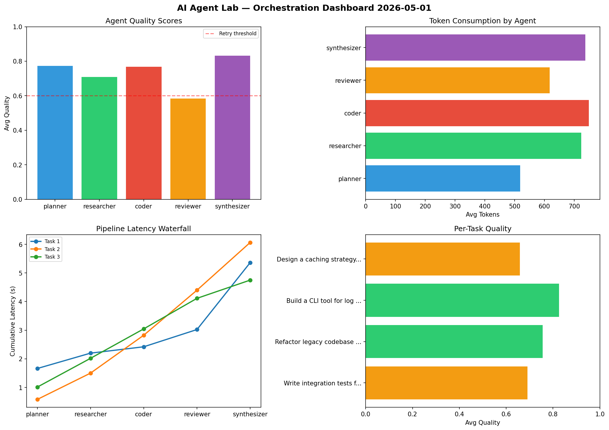

# AI Agent Lab — Orchestration Report 2026-05-01

**Run ID:** `f644e03cf6` | **Tasks:** 4 | **Avg Quality:** 0.733

## Aggregate Metrics

| Metric | Value |
|--------|-------|
| avg_latency | 5.495 |
| total_tokens | 13388 |
| avg_quality | 0.733 |

## Delta vs Yesterday

| Metric | Today | Yesterday | Change |
|--------|-------|-----------|--------|
| avg_latency | 5.495 | 5.566 | 📉 -1.3% |
| total_tokens | 13388 | 14698 | 📉 -8.9% |
| avg_quality | 0.733 | 0.702 | 📈 4.4% |

## Pipeline Results

### Write integration tests for payment processing module
| Agent | Quality | Latency | Tokens | Status |
|-------|---------|---------|--------|--------|
| planner | 0.73 | 1.662s | 566 | success |
| researcher | 0.59 | 0.537s | 567 | needs_retry |
| coder | 0.618 | 0.222s | 712 | success |
| reviewer | 0.559 | 0.602s | 686 | needs_retry |
| synthesizer | 0.958 | 2.338s | 827 | success |

### Refactor legacy codebase to use dependency injection
| Agent | Quality | Latency | Tokens | Status |
|-------|---------|---------|--------|--------|
| planner | 0.751 | 0.582s | 819 | success |
| researcher | 0.934 | 0.919s | 658 | success |
| coder | 0.942 | 1.324s | 1057 | success |
| reviewer | 0.53 | 1.573s | 620 | needs_retry |
| synthesizer | 0.624 | 1.667s | 764 | success |

### Build a CLI tool for log analysis
| Agent | Quality | Latency | Tokens | Status |
|-------|---------|---------|--------|--------|
| planner | 0.974 | 1.013s | 156 | success |
| researcher | 0.726 | 1.005s | 890 | success |
| coder | 0.981 | 1.029s | 763 | success |
| reviewer | 0.652 | 1.066s | 448 | success |
| synthesizer | 0.799 | 0.637s | 823 | success |

### Design a caching strategy for high-traffic endpoints
| Agent | Quality | Latency | Tokens | Status |
|-------|---------|---------|--------|--------|
| planner | 0.636 | 2.285s | 536 | success |
| researcher | 0.583 | 0.659s | 780 | needs_retry |
| coder | 0.533 | 1.952s | 464 | needs_retry |
| reviewer | 0.594 | 0.296s | 717 | needs_retry |
| synthesizer | 0.946 | 0.613s | 535 | success |
