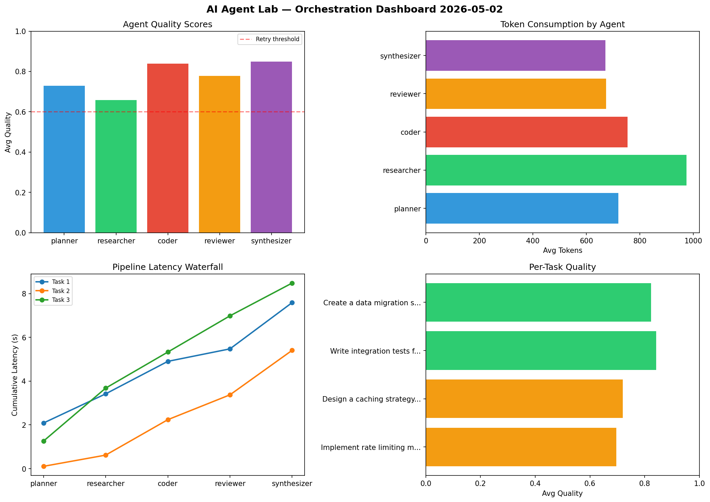

# AI Agent Lab — Orchestration Report 2026-05-02

**Run ID:** `a16154b60b` | **Tasks:** 4 | **Avg Quality:** 0.77

## Aggregate Metrics

| Metric | Value |
|--------|-------|
| avg_latency | 6.827 |
| total_tokens | 15164 |
| avg_quality | 0.77 |

## Delta vs Yesterday

| Metric | Today | Yesterday | Change |
|--------|-------|-----------|--------|
| avg_latency | 6.827 | 5.495 | 📈 24.2% |
| total_tokens | 15164 | 13388 | 📈 13.3% |
| avg_quality | 0.77 | 0.733 | 📈 5.0% |

## Pipeline Results

### Implement rate limiting middleware
| Agent | Quality | Latency | Tokens | Status |
|-------|---------|---------|--------|--------|
| planner | 0.582 | 2.086s | 583 | needs_retry |
| researcher | 0.685 | 1.332s | 1187 | success |
| coder | 0.819 | 1.485s | 818 | success |
| reviewer | 0.538 | 0.571s | 811 | needs_retry |
| synthesizer | 0.86 | 2.113s | 409 | success |

### Design a caching strategy for high-traffic endpoints
| Agent | Quality | Latency | Tokens | Status |
|-------|---------|---------|--------|--------|
| planner | 0.541 | 0.107s | 601 | needs_retry |
| researcher | 0.539 | 0.512s | 720 | needs_retry |
| coder | 0.801 | 1.619s | 973 | success |
| reviewer | 0.753 | 1.136s | 1011 | success |
| synthesizer | 0.966 | 2.033s | 1021 | success |

### Write integration tests for payment processing module
| Agent | Quality | Latency | Tokens | Status |
|-------|---------|---------|--------|--------|
| planner | 0.909 | 1.26s | 494 | success |
| researcher | 0.601 | 2.42s | 878 | success |
| coder | 0.935 | 1.648s | 285 | success |
| reviewer | 0.843 | 1.656s | 350 | success |
| synthesizer | 0.92 | 1.497s | 633 | success |

### Create a data migration script for schema v2
| Agent | Quality | Latency | Tokens | Status |
|-------|---------|---------|--------|--------|
| planner | 0.885 | 0.521s | 1199 | success |
| researcher | 0.807 | 0.694s | 1109 | success |
| coder | 0.799 | 0.98s | 940 | success |
| reviewer | 0.975 | 1.955s | 520 | success |
| synthesizer | 0.649 | 1.683s | 622 | success |
