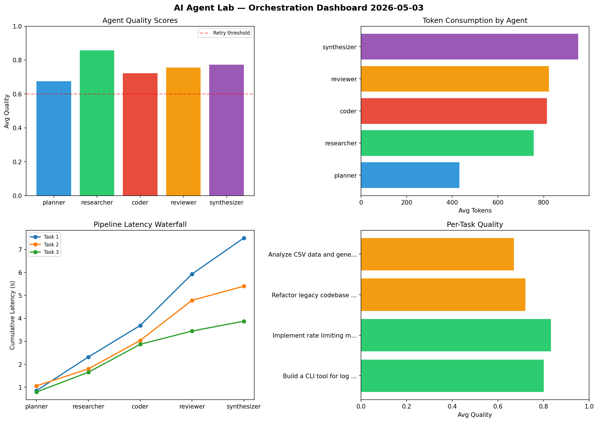

# AI Agent Lab — Orchestration Report 2026-05-03

**Run ID:** `a9455d8a65` | **Tasks:** 4 | **Avg Quality:** 0.756

## Aggregate Metrics

| Metric | Value |
|--------|-------|
| avg_latency | 5.825 |
| total_tokens | 15108 |
| avg_quality | 0.756 |

## Delta vs Yesterday

| Metric | Today | Yesterday | Change |
|--------|-------|-----------|--------|
| avg_latency | 5.825 | 7.526 | 📉 -22.6% |
| total_tokens | 15108 | 14262 | 📈 5.9% |
| avg_quality | 0.756 | 0.731 | 📈 3.4% |

## Pipeline Results

### Build a CLI tool for log analysis
| Agent | Quality | Latency | Tokens | Status |
|-------|---------|---------|--------|--------|
| planner | 0.541 | 0.854s | 237 | needs_retry |
| researcher | 0.819 | 1.463s | 479 | success |
| coder | 0.955 | 1.371s | 1042 | success |
| reviewer | 0.731 | 2.239s | 864 | success |
| synthesizer | 0.96 | 1.572s | 805 | success |

### Implement rate limiting middleware
| Agent | Quality | Latency | Tokens | Status |
|-------|---------|---------|--------|--------|
| planner | 0.948 | 1.06s | 537 | success |
| researcher | 0.925 | 0.739s | 417 | success |
| coder | 0.677 | 1.236s | 821 | success |
| reviewer | 0.82 | 1.75s | 648 | success |
| synthesizer | 0.797 | 0.613s | 862 | success |

### Refactor legacy codebase to use dependency injection
| Agent | Quality | Latency | Tokens | Status |
|-------|---------|---------|--------|--------|
| planner | 0.679 | 0.792s | 382 | success |
| researcher | 0.81 | 0.86s | 1148 | success |
| coder | 0.503 | 1.216s | 832 | needs_retry |
| reviewer | 0.916 | 0.578s | 753 | success |
| synthesizer | 0.695 | 0.429s | 1065 | success |

### Analyze CSV data and generate statistical summary
| Agent | Quality | Latency | Tokens | Status |
|-------|---------|---------|--------|--------|
| planner | 0.531 | 2.165s | 570 | needs_retry |
| researcher | 0.872 | 1.715s | 981 | success |
| coder | 0.751 | 0.553s | 564 | success |
| reviewer | 0.56 | 1.899s | 1028 | needs_retry |
| synthesizer | 0.64 | 0.195s | 1073 | success |
