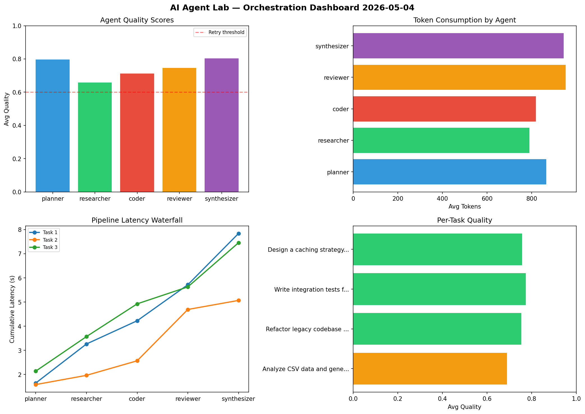

# AI Agent Lab — Orchestration Report 2026-05-04

**Run ID:** `e49ef5248b` | **Tasks:** 4 | **Avg Quality:** 0.744

## Aggregate Metrics

| Metric | Value |
|--------|-------|
| avg_latency | 6.721 |
| total_tokens | 17474 |
| avg_quality | 0.744 |

## Delta vs Yesterday

| Metric | Today | Yesterday | Change |
|--------|-------|-----------|--------|
| avg_latency | 6.721 | 5.825 | 📈 15.4% |
| total_tokens | 17474 | 15108 | 📈 15.7% |
| avg_quality | 0.744 | 0.756 | 📉 -1.6% |

## Pipeline Results

### Analyze CSV data and generate statistical summary
| Agent | Quality | Latency | Tokens | Status |
|-------|---------|---------|--------|--------|
| planner | 0.976 | 1.648s | 912 | success |
| researcher | 0.552 | 1.616s | 654 | needs_retry |
| coder | 0.623 | 0.961s | 962 | success |
| reviewer | 0.553 | 1.492s | 773 | needs_retry |
| synthesizer | 0.743 | 2.122s | 1158 | success |

### Refactor legacy codebase to use dependency injection
| Agent | Quality | Latency | Tokens | Status |
|-------|---------|---------|--------|--------|
| planner | 0.862 | 1.585s | 582 | success |
| researcher | 0.601 | 0.382s | 663 | success |
| coder | 0.966 | 0.602s | 673 | success |
| reviewer | 0.636 | 2.124s | 1192 | success |
| synthesizer | 0.705 | 0.375s | 966 | success |

### Write integration tests for payment processing module
| Agent | Quality | Latency | Tokens | Status |
|-------|---------|---------|--------|--------|
| planner | 0.521 | 2.141s | 934 | needs_retry |
| researcher | 0.925 | 1.429s | 1126 | success |
| coder | 0.515 | 1.355s | 688 | needs_retry |
| reviewer | 0.974 | 0.702s | 876 | success |
| synthesizer | 0.936 | 1.828s | 801 | success |

### Design a caching strategy for high-traffic endpoints
| Agent | Quality | Latency | Tokens | Status |
|-------|---------|---------|--------|--------|
| planner | 0.83 | 1.135s | 1033 | success |
| researcher | 0.557 | 1.057s | 717 | needs_retry |
| coder | 0.745 | 0.403s | 951 | success |
| reviewer | 0.823 | 2.176s | 967 | success |
| synthesizer | 0.831 | 1.75s | 846 | success |
